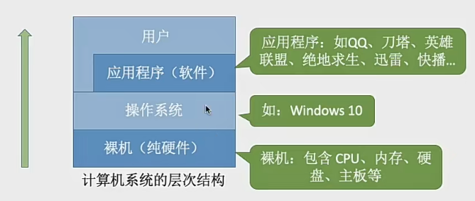
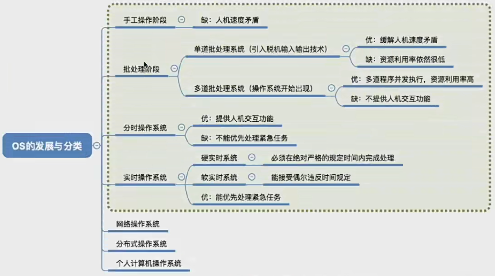

常见的操作系统

ios macos linux windows Android 等等

操作系统的概念和定义：操作系统 Operating System OS 是指控制和管理整个计算机系统的硬件和软件资源，并合理地组织调度计算机的工作和资源分配；以提供给用户和其他软件方便的接口环境；它是计算机系统中最基本的系统软件

操作系统作为系统资源的管理者 我们需要进行:
1. 处理机管理
2. 存储器管理
3. 文件管理
4. 设备管理

操作系统也要对上层提供更加方便易用的服务，提供更加简单友好的接口，然后程序通过使用操作系统的接口来对硬件资源进行调用

### 操作系统提供的接口功能
- 用户向
GUI 图形用户界面

联机命令接口 = 交互式命令接口 -> dos linux

脱机命令接口 = 批处理命令接口 -> shell脚本 

- 程序员向
程序接口： 可以在程序中进行系统调用来使用程序接口。普通用户不能直接使用程序接口，要通过程序代码进行间接调用

#### 操作系统的功能和目标 - 作为最接近硬件层次的软件
需要实现对硬件机器的扩展

没有任何软件能支持的计算机称为裸机，在裸机上安装的操作系统，可以提供资源管理功能和方便用户的服务功能，将逻辑改造成功能更强、使用更方便的机器

通常把覆盖了软件的机器称为扩充机器 又称为虚拟机

操作系统对硬件的扩展：将cpu、内存、磁盘、显示器、键盘等功能合理的组织起来，让各种硬件能够互相配合协调，实现更多更复杂的功能

### 操作系统的四个特征
1. **并发**: 指两个或者多个事件在同一时间间隔内发生，是在宏观上同时发生，在微观上是交替发生的，这里有个容易混淆的概念，并行 -- 并行是指两个或者多个事件在同一时刻发生(__操作系统的出现就是为了支持多道程序技术而诞生的，所以操作系统是和程序并发一起诞生的__)
2. **共享**: 资源共享，是指系统中的资源可供内存中多个并发执行的进程共同可用。
        有两种资源共享方式
        - 互斥共享：系统中的某些资源，虽然可以提供给多个进程使用，但是一个时间段内只允许一个进程访问该资源
        - 同时共享：系统中的某些资源，允许一个时间段内由多个进程“同时”对它们进行访问

        所谓 同时 往往是宏观上的，而在微观上，这些进程可能是交替地对该资源进行访问的(分时分享)
        
        1. 互斥共享： 微信和QQ在视频的时候，是不允许同时访问摄像头的。
        2. 同时共享： QQ发文件A 微信发文件B 宏观上同时发送文件，说明都在访问磁盘静态资源，从中读取数据，微观上其实还是交替访问硬盘的。
3. **虚拟**: 虚拟是指把一个物理上的实体变为若干个逻辑上的对应物。物理实体是实际存在的，而逻辑上的对应物是用户感受到的。
        虚拟技术有
        - 空分复用技术 如虚拟存储器技术
        - 时分复用技术 如虚拟处理器
        显然如果失去了并发性，则一个时间段内系统中只需运行一道程序，那么就失去了实现虚拟性的意义了。因此，没有并发性，就谈不上虚拟性
4. **异步**: 在多道程序环境下，允许多个程序并发执行，但由于资源有限，进程的执行不是一贯到底的，而是走走停停的，以不可知的速度向前推进，这就是程序的异步性。
        只有先有并发性才会有异步性

### OS的发展和分类

