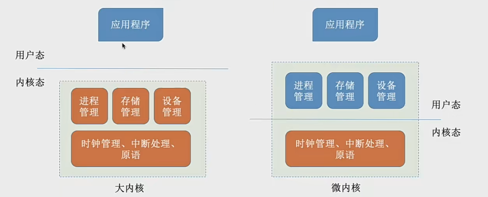
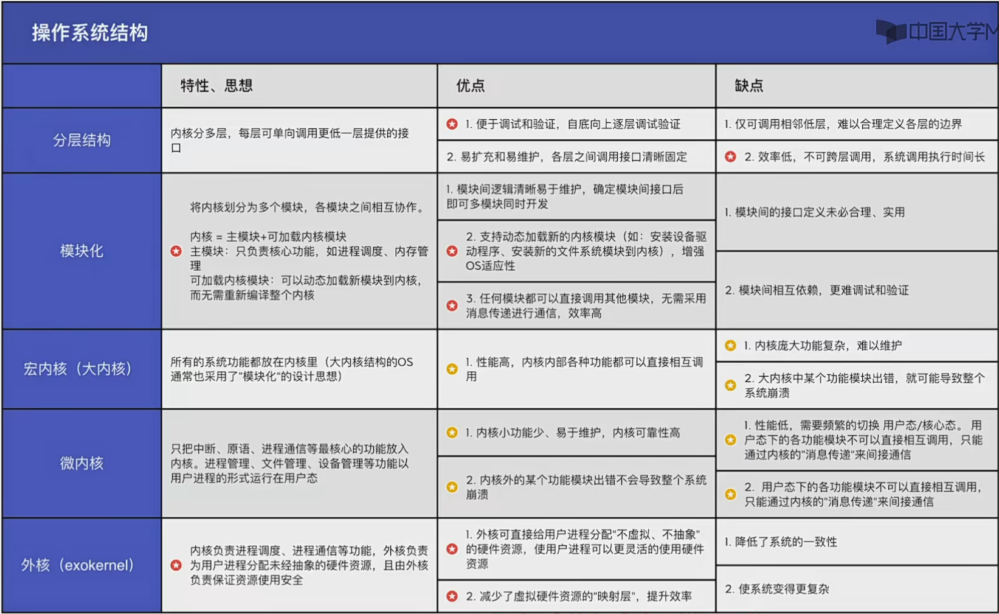

## 操作系统的运行机制

### 两种指令
操作系统内核作为"管理者"，有时候会让CPU执行一些特权指令，比如：内存清零。这些指令影响重大，只允许“管理者” -- 即操作系统内核来使用

像我们平常写得程序 就是应用程序，只能使用“非特权指令”，如：加法指令、减法指令

在CPU设计和生产的时候就划分了特权指令和非特权指令，因此CPU执行一条指令前就能判断其类型
#### 特权指令

#### 非特权指令

### 两种处理器状态
CPU能判断指令类型，但是它怎么区分此时正在运行的是内核程序还是应用程序？

这就要提到CPU的两种运行状态，“核心态” 和 “用户态”

CPU中有一个寄存器叫做程序状态字寄存器(PSW),其中有个二进制位，1表示内核态，0表示用户态

内核态->用户态，就要执行一条特权指令 -- 修改PSW的标志位为“用户态”，这个动作意味着操作系统将主动让出CPU的使用权

用户态->内核态，由“中断”引发，硬件自动完成变态过程，出发中断信号意味着操作系统将强行夺回cpu的使用权（除了非法使用特权指令之外，还有很多事件会出发中断信号，一个共性是但凡需要操作系统接入的地方就都会触发中断信号）
#### 核心态
核心态也叫内核态，当cpu处于内核态的时候，说明此时运行的是内核程序，此时可以执行特权指令

#### 用户态
当cpu处于用户态的时候，说明此时运行的是应用程序，此时只能执行非特权指令

### 两种程序
1. 内核程序
2. 应用程序

--------------

## 中断和异常
### 中断的作用
内核态->用户态，就要执行一条特权指令 -- 修改PSW的标志位为“用户态”，这个动作意味着操作系统将主动让出CPU的使用权

用户态->内核态，由“中断”引发，硬件自动完成变态过程，出发中断信号意味着操作系统将强行夺回cpu的使用权（除了非法使用特权指令之外，还有很多事件会出发中断信号，一个共性是但凡需要操作系统接入的地方就都会触发中断信号）
### 中断的类型
#### 内中断 也叫异常
与当前的指令有关，中断信号来源CPU内部

例如：
1. 试图在用户态下执行特权指令 - 由致命错误引起，内核程序无法修复该错误，因此一般不再将CPU使用权还给引发终止的应用程序，如：整数除0、非法使用特权指令
2. 执行非特权指令的时候参数异常或者指令非法 - 由错误条件引起的，可能被内核程序修复，内核程序修复故障后会把cpu使用权还给应用程序，让它继续执行，比如却也故障
3. 有时候应用程序需要请求操作系统的内核服务，这个时候就会插入一条特殊的指令---陷入指令，该指令会引发一个内部中断的信号
#### 外中断
与当前的指令无关，中断信号来源于CPU外部

例如：
1. 时钟中断 -- 由时钟不见引发的中断信号。时钟部件每隔一个时间片就会给cpu发送一个时钟中断信号，通过这个中断信号就能实现程序并发进行了
2. I/O中断 -- 由输入输出设备发来的中断信号
### 中断机制的基本原理
不同的中断信号，需要用不同的中断处理程序来处理。当CPU检测到中断信号后，会根据中断信号的类型去查询“中断向量表”，以此来找到相应的中断处理程序在内存中的存放位置

## 系统调用
### 什么是系统调用？
知识点回顾：

操作系统作为用户和计算机硬件之间的接口，需要向上提供一些简单易用的服务。包括命令接口和程序接口。其中程序接口由一组系统调用组成

"系统调用"是操作系统提供给应用程序(程序员/编程人员)使用的接口，可以理解为一种可供应用程序调用的特殊函数，__应用程序可以通过系统调用来请求获得操作系统内核的服务__

### 系统调用和库函数的区别
|  途径   | 系统调用描述  |
|  :----:  | :----:  |
| 普通应用程序  | 可以直接进行系统调用，也可以使用库函数。有的库函数涉及系统调用，有的不涉及 |
| 编程语言  | 向上提供库函数。有时会将系统调用封装成库函数，以隐藏系统调用的一些细节，使程序员更加方便 |
| 操作系统  | 向上提供系统调用，使得上层程序能请求内核服务 |
| 裸机  |   didi   |

^
|
由下至上看

不涉及系统调用的库函数：如取绝对值的函数
涉及系统调用的库函数：创建一个新文件

### 小例子：为什么系统调用是必须的？
同时打印两篇论文当两个进程如果可以随意的、并发地使用资源会导致所有的内容会杂糅到一起 

所以操作系统内核对共享资源统一管理，并向上提供系统调用，用户进程想要对打印机这种资源进行使用的时候，我们就要通过系统调用向操作系统内核发出请求，内核会对各个请求进行协调处理

### 什么功能要用系统调用实现？
按功能分类
1. 设备管理 - 完成设备的 请求/释放/启动 等功能
2. 文件管理 - 完成文件的 读/写/创建/删除 等功能
3. 进程控制 - 完成进程的 创建/撤销/阻塞/唤醒 等功能
4. 进程通信 - 完成进程之间的 消息传递/信号传递 等功能
5. 内存管理 - 完成内存的 分配/回收 等功能

应用程序通过**系统调用**请求操作系统的服务。而系统中的各种共享资源都由操作系统内核统一掌管，因此凡是与共享资源有关的操作(如存储分配、I/O操作、文件管理等)，都必须通过系统调用的方式向操作系统内核提出服务请求，由操作系统内核代为完成。这样可以保证系统的稳定性和安全性，防止用户的非法操作。

### 系统调用的过程
传递系统调用参数 -> 执行陷入指令(用户态) -> 执行相应的内中断变成核心态处理系统调用(核心态) -> 返回应用程序

这里我们要注意别名：
陷入指令 = trap 指令 = 访管指令

## 操作系统的体系结构
操作系统体系结构：
1. 大内核 = 宏单核 = 单内核 **常考**
2. 微内核  **常考**
3. 分层结构
4. 模块化
5. 外核

内核是操作系统最基本、最核心的部分，实现操作系统内核功能的那些程序就是内核程序
- 时钟管理 -> 实现计时功能
- 中断处理 -> 负责实现中断机制
- 原语
        1. 是一种特殊的程序
        2. 处于操作系统最底层，是最接近硬件的部分
        3. 这种程序的运行具有原子性--其运行只能一气呵成，不能中断
        4. 运行时间较短、调用频繁
- 对系统资源进行管理的功能
        1. 进程管理
        2. 存储器管理
        3. 设备管理

当应用程序想要请求操作系统的服务，这个服务同时涉及到进程管理、存储管理、设备管理的功能，我们对比看看打内核和微内核体系结构上会有哪些区别？

大内核只需要两次变态，而微内核需要六次变态

我们cpu状态转换的过程也是有成本的，需要消耗不少时间，频繁的状态转换会降低系统性能

### 大纲增加的考题
分层结构、模块化、外核

这种应该是简单考题，了解各种内核的体系结构，了解它们的优缺点

