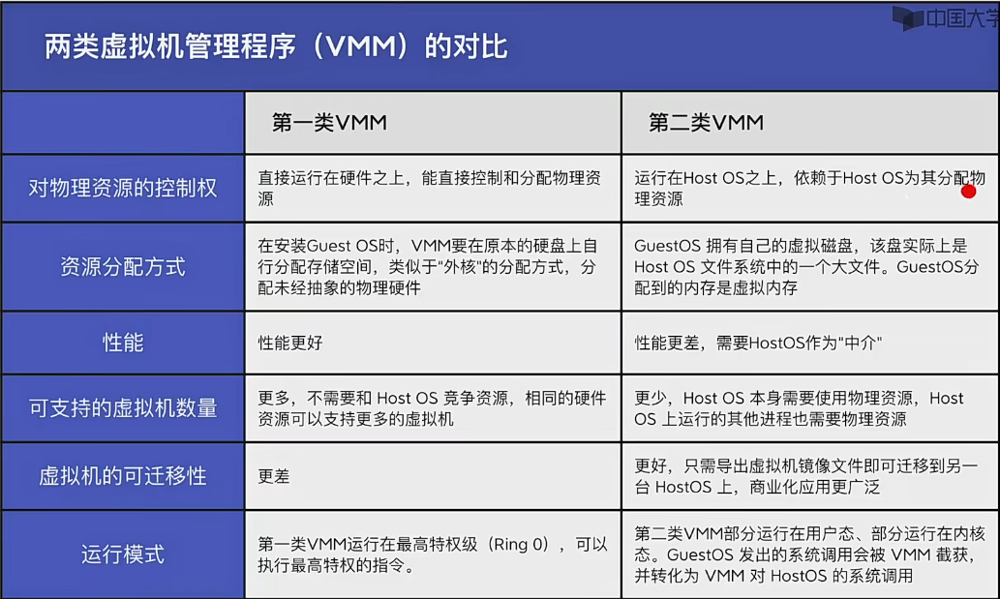

## 操作系统引导
1. 什么是操作系统引导
操作系统引导(boot) -- 开机的时候如何让操作系统运行起来

2. 磁盘里边有哪些相关数据？
磁盘里除了我们常用能看到的 CDEF 盘之外，还有在磁盘头有一个主引导记录 MBR，这里包括磁盘引导程序和分区表，这里的分区表就是一个数据结构

C盘： 引导记录 PBR：负责找到启动管理器 - 根目录 - 其他

---

补充 操作系统的主存由 RAM(关机断电清空) 和 ROM(BIOS) 组成, 包含: ROM引导程序，即自举程序 关机断电不清空

---
3. 操作系统引导过程

- CPU 从一个特定主存地址开始，取指令，执行ROM中的引导程序(先进行硬件自检，再开机)
- 将磁盘的第一块 == 主引导记录 读入内存，执行磁盘引导程序，扫描分区表
- 从活动分区(又称主分区 即安装了操作系统的分区)读入人去引导记录，执行其中的程序
- 从根目录下找到完整的操作系统初始化程序(即 启动管理器)并执行，完成"开机"的一系列操作

## 虚拟机
https://github.com/ameamezhou/container

