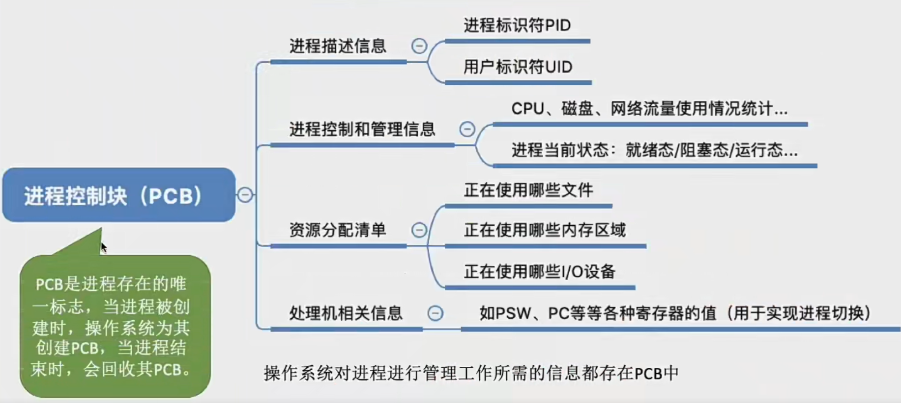
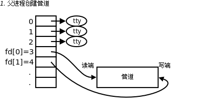
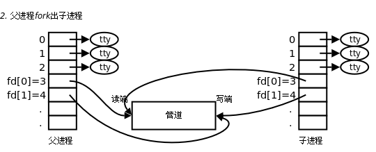
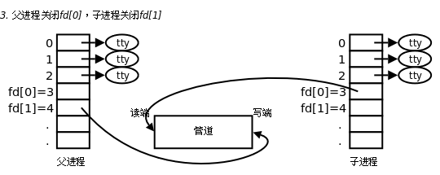

# 进程
## 概念 - 理解进程和程序的区别
程序：是静态的，就是个存放在磁盘的可执行文件，就是一些列的指令集合

进程：是动态的，是程序的一次执行过程  Process

## 组成 - 一个进程由哪些部分组成
### 进程的组成 = PCB + 程序段 + 数据段
当进程被创建的时候，操作系统会给进程分配一个唯一的、不重复的“身份证” -- PID Process ID，进程ID

操作系统要记录PID、进程所属用户ID(UID)

还要记录给进程分配了哪些资源，比如 分配了多少内存、正在使用哪些IO设备、正在使用哪些文件

还要记录进程的运行情况 如 CPU 使用时间、磁盘使用情况、网络流量使用情况等

第一个是用来区分进程，第二个是操作系统对资源的管理，第三个可以实现操作系统对进程的控制和对资源的调度


PCB是进程存在的唯一标志，当进程被创建的时候，操作系统为它创建PCB，当进程结束的时候，会回收PCB

程序段 - 程序的代码 或者说指令序列

数据段 - 运行过程中产生的各种数据 如：程序中定义的变量

PCB是给操作系统用的。程序段、数据段是给进程自己用的

一个进程实体(进程映像)由PCB、程序段、数据段组成。进程是动态的，进程实体(进程映像)是静态的。

进程是进程实体的运行过程，是系统进行资源分配和调度的一个独立单位。

## 特征 - 进程有哪些重要特征
1. 动态性 - 进程是程序的一次执行过程，是动态地产生、变化和消亡的
2. 并发性 - 内存中有多个进程实体，各个进程可以并发执行
3. 独立性 - 进程是能够独立运行、独立获得资源、独立接受调度的基本单位
4. 异步性 - 各进程按格子独立的、不可预知的速度向前推进，操作系统要提供“进程同步机制”来解决异步问题
5. 结构性 - 每个进程都会配置一个PCB。从结构上看，进程由程序段、数据段、PCB组成

## 进程的状态和状态转换
1. 创建态
进程正在被创建的时候，它的状态就是"创建态"，再这个阶段操作系统会为进程分配资源、初始化PCB
2. 就绪态
进程创建完成后，便进入了"就绪态"，处于就绪态的进程已经具备运行条件，单由于没有空闲CPU，就暂时不能运行
3. 运行态
一个进程此时在CPU上运行的时候就是运行态
4. 阻塞态
在进程运行的过程中，可能会请求等待某个事件的发生，例如等待某种系统资源的分配，或者等待其他进程的响应，这个时候程序无法往下执行，此时操作系统会让这个进程下CPU，并让它进入"阻塞态"
此时CPU空闲，就会让另一个“就绪态”进程上CPU执行指令
5. 终止态
一个进程可以执行 exit 系统调用，请求操作系统终止该进程。此时该进程会进入 终止态，操作系统会让该进程下CPU，并回收内存空间等资源，最后还要回收该进程的PCB


状态转换：

进程不能从阻塞态直接变为运行态，也不能从就绪态直接变为阻塞态

因为进入阻塞态是进程主动请求的，必然需要进程在运行的时候才能发出这种请求

2 3 4 是三种基本状态

在进程的PCB中会有一个变量state来表示进程当前的状态

### 进程的组织
链接方式：
1. 执行指针 --> PCB2 (单CPU计算机中，同一时刻只有一个进程处于运行状态)
2. 就绪队列指针 --> PCB5 -> PCB1 -> PCB4 (指向当前处于就绪态的进程，通常会把优先级高的放在队头)
3. 阻塞队列指针 --> PCB3 (很多操作系统会根据阻塞原因的不同再氛围多个阻塞队列)
        比如
        等待打印机阻塞队列 --> xxx
        等待磁盘阻塞队列 --> xxxx

## 进程控制
进程控制的主要功能是对系统中所有的进程实施有效的管理，它具有创建新进程、撤销已有进程、实现进程状态转换等功能

简化理解：反正进程控制就是要实现进程的状态转换

如何实现进程控制？ 需要通过原语
```cpp
/*
原语:
原语是一种特殊的程序，它的执行具有原子性。也就是说这段程序运行必须一气呵成不可中断

原语的主要功能是：设备驱动，CPU切换等

可以用“关中断指令”和“开中断指令” 这两个特权指令实现原子性

因为在正常情况下 CPU 每执行完一条指令都会例行检查食肉有中断信号需要处理，如果由，就会暂停运行程序执行相应的中断处理程序

这样我们执行关中断指令 CPU 就不会取感知是否有外部的中断信号，这个期间我们就可以执行进程状态转换的操作，并在执行完后执行开中断指令，开始感知外部的中断信号，从而实现原语的原子性
*/
```
这里也就是说，进程控制下的进程状态转换的过程需要一气呵成

### 进程控制相关的原语
一、 进程的创建

创建原语：
1. 申请空白PCB
2. 为新进程分配所需资源
3. 初始化PCB
4. 将PCB插入就绪队列
创建态 -> 就绪态

引起创建进程的事件
1. 用户登录 - 分时系统中，用户登录成功，系统会为其建立一个新的进程
2. 作业调度 - 多道批处理系统中，有新的左也放入内存时，会为其建立一个新的进程
3. 提供服务 - 用户向操作系统提出某些请求时，会新建一个进程处理该请求
4. 应用请求 - 由用户进程主动请求创建一个子进程

二、 进程的终止

撤销原语：
1. 从PCB集合中找到终止进程的PCB
2. 若进程正在运行，立即剥夺CPU，将CPU分配给其他的进程
3. 终止其所有子进程
4. 将该进程拥有的所有资源归还给父进程或者操作系统
5. 删除PCB

引起进程终止的事件
1. 正常结束
2. 异常结束
3. 外界干预

三、 进程的阻塞和唤醒

3.1 进程的阻塞

阻塞原语：
1. 找到要阻塞的进程对应的PCB
2. 保护进程运行现场，将PCB状态信息改成 阻塞态 ，暂时停止进程的运行
3. 将PCB插入相应事件的等待队列

引起进程阻塞的事件
1. 需要等待系统分配某种资源
2. 需要等待相互合作的其他进程完成工作

3.2 进程的唤醒

唤醒原语
1. 在事件等待队列中找到PCB
2. 将pcb从等待队列中移除，设置为就绪态
3. 将PCB插入就绪队列，等待被调度

引起唤醒的事件
1. 等待的事件发生

四、 进程的切换

切换原语：
1. 将运行环境存入PCB
2. PCB移入相应的队列
3. 选择另一个进程执行，并更新其PCB
4. 根据PCB回复新进程所需的运行环境

引起进程切换的事件
1. 当前进程时间片到
2. 有更高优先级的进程到达
3. 当前进程主动阻塞
4. 当前进程终止

---

补充：程序如何运行

其实就是把写好的代码编译成可执行文件 然后将程序放入内存，CPU从内存中取出指令

CPU中会设置很多"寄存器"，用来存放程序运行过程中所需要的某些数据

比如我们前面有提到的 PSW: 程序状态字寄存器

PC：程序计数器，存放下一条指令的地址

IR：指令寄存器，存放当前正在执行的指令

通用寄存器：存放其他的必要信息

... 


这里如果我们程序运行到一半需要切换的时候，寄存器存储的内容我们会将它保存在PCB中，也就是说在PCB中保存一个进程的运行环境，保存一些必要的寄存信息，以免进程切换的时候丢失了内容

---

其实无论是上面的哪一种原语 无非做得就是这三种事情：
1. 更新PCB中的信息
2. 将PCB插入合适的队列
3. 分配/回收资源

## 进程通信 IPC
进程间通信(Inter-Process Communication, IPC)是指两个进程间产生数据交互

进程是分配系统资源的单位(包括内存地址空间)，因此各进程拥有的内存地址空间相互独立。为了保证安全，进程间的地址空间不能共享，只能访问自己的

1. 管道
管道是一种半双工的通信方式，数据只能单向传递，并且只能在有亲缘关系的进程间使用，一般是在父子进程中使用

管道是一种特殊的共享文件。其实就是在内存中开辟一个大小固定的内存缓冲区

管道特点：
-	管道只允许具有血缘关系的进程间通信，如父子进程间的通信。
-	管道只允许单向通信。
-	管道内部保证同步机制，从而保证访问数据的一致性。
-	面向字节流
-	管道随进程，进程在管道在，进程消失管道对应的端口也关闭，两个进程都消失管道也消失。





考研管道特点:
- 管道是半双工通信，如果想要实现双向通信就要设置两个管道
- 各个进程互斥地访问管道，这一功能由操作系统实现
- 当管道写满的时候，写进程会被阻塞，直到读进程将管道中的数据取走，即可唤醒写进程
- 管道读空的时候，读进程会被阻塞，直到写进程往里写入，就可以唤醒读进程
- 管道中的数据一旦被读出就会彻底消失。因此多个进程读同一个管道的时候，可能会错乱。对此，通常由两种解决方案
        a. 一个管道允许多个写进程 一个读进程
        b. 允许多个写进程 多个读进程，但是系统会让个个读进程轮流从管道中读取数据 (Linux 的方案)

写进程往管道写数据，即便管道没被写满，只要管道没空，读进程就可以从管道读数据

读进程从管道读数据，即便管道没被读空，只要管道没满，写进程就可以往管道写数据

- 匿名管道
我们日常在Linux中使用的管道：ps aux|grep python 这种管道就是匿名管道，匿名管道主要利用了，创建子进程的时候会把父进程的文件描述符表拷贝一份这个特征，通过这个特征，父子进程就看到了一个公共的资源—管道，并同时拥有对该管道腹泻的权利，那么一方读，一方写，就可以完成进程之间的通信了。
所谓的匿名管道就是说，没有名字。。。你根本不知道这个管道文件存放在哪，也不知道这个管道文件的文件名，唯一跟这个跟管道文件有联系的只有父子进程中的文件描述符。所以只有有亲缘关系的进程才能通过匿名管道进行通信

- 命名管道
在以一切皆文件为原则的Linux系统中，管道也是一种文件（特殊文件），可以使用mkfifo命令创建一个管道文件，然后就可以完成非亲缘关系的进程之间的通信了

- 管道通信缺点
管道最大的缺点，管道是基于文件系统的！所以不管是读还是写，都要求访问磁盘进行I/O操作，I/O的速度比较慢，所以不适合做多个client的结构，不然会很慢。
因为管道也是一个文件，所以是文件传输的大小就是有限的，使用 man 7 pipe就能看到


2. 共享存储 - 共享内存
共享内存就是允许两个或多个进程共享一定的存储区。当一个进程改变了这块地址中的内容的时候，其它进程都会察觉到这个更改。因为数据不需要在客户机和服务器端之间复制，数据直接写到内存，不用若干次数据拷贝，所以这是最快的一种IPC。它是专门针对其他进程通信方式运行效率低而专门设计的。它往往与其他通信机制，如信号量来配合使用，来实现进程间的同步和通信。

为了避免出错，各个进程对共享空间的访问应该是互斥的，各个进程可使用操作系统内核提供的同步互斥工具，如 P、V操作

- 	共享内存进行通信的一个好处是效率高，因为进程可以直接读写内存，而不需要任何数据的拷贝，对于像管道和消息队列里等通信方式，则需要在内核和用户空间就进行四次数据拷贝，而共享内存只拷贝两次，一次从输出文件到共享内存区，一次从共享内存到输出文件。

-	一般而言进程之间在共享内存时，并不总是读写少量数据后就解除映射，有新的通信时再重新建立共享内存区域；而是保存内存中的内容，再接触映射时才会写回文件，因此采用共享内存的通信方式效率非常高

-	共享内存的两种实现方式：内存映射，共享内存机制

3. 消息传递
进程间的数据交换以格式化的消息为单位。进程通过操作系统提供的“发送/接收消息”两个原语进行数据交换

消息格式包括：消息头 消息体

消息头包括：发送的进程ID、接收的进程ID、消息长度等格式化的信息

同时消息传递也分为
- 直接通信方式
消息发送进程要知名接收进程的ID

- 间接通信方式
通过 信箱 间接地通信，因此又称为 信箱通信方式
