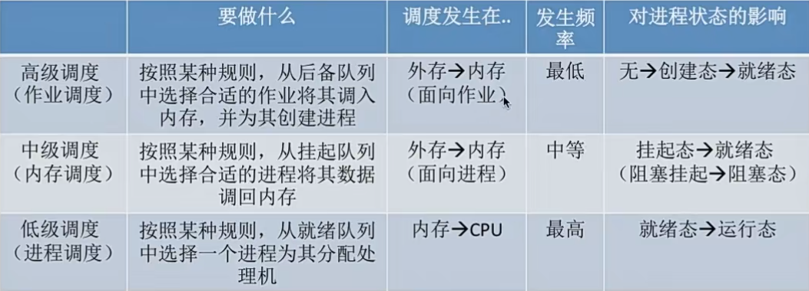
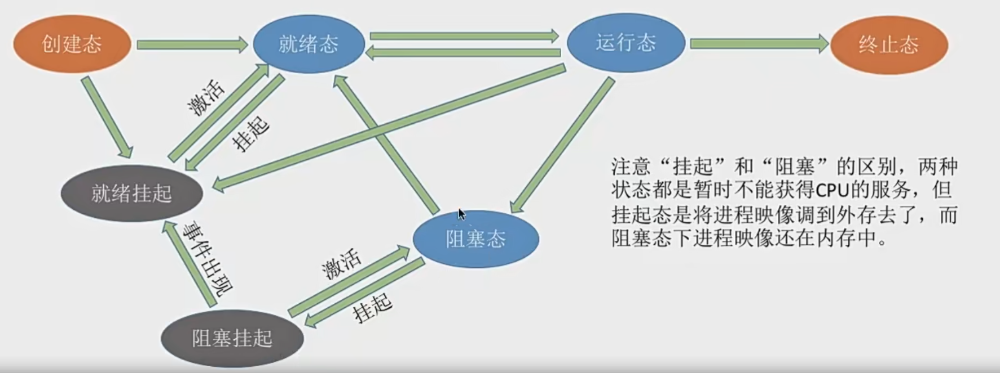

# 处理机调度
## 基本概念
当有一堆任务要处理，但是由于资源有限，这些事情没办法同时处理。这就需要确定某种规则来决定处理这些任务的顺序，这就是“调度”研究的问题

## 三个层次
### 高级调度 作业调度
作业就是一个具体的任务

用户向操作系统提交一个作业 -> 用户让操作系统启动一个程序来处理一个具体的任务

高级调度 - 作业调度：按照一定原则从外村的作业后备队列中挑选一个作业调入内存，并创建进程。每个作业只调入一次，调出一次。作业调入时会创建PCB，调出时会撤销PCB
### 中级调度 内存调度
内存不够时，可以将某些进程的数据调出外存，等内存空间空闲或者进程需要运行时再重新调入内存

暂时调到外存等待的进程状态称为挂起状态。被挂起的进程PCB会被组织成挂起队列

中级调度 - 按照牟总策略决定将哪个处于挂起状态的进程重新调入内存
### 低级调度 进程调度
按照某种策略从就绪队列中取出一个进程，将处理机分配给它

进程调度是操作系统中最基本的调度，在一般的操作系统中都必须配置进程调度

## 三层调度的联系和对比

## 补充知识
### 进程的 挂起态
暂时调到外存等待的进程状态就是挂起状态 挂起态 suspend

挂起态又可以进一步细分为就绪挂起、阻塞挂起两种状态

### 七状态模型
我们从本来的 创建态 -> 就绪态 <-> 运行态 -> 终止态
                        ^           |
                        |           v
                        |--------  阻塞态

变成七状态模型  

### 调度算法的评价指标
1. CPU利用率
    利用率 = 忙碌的时间/总时间
2. 系统吞吐量
    系统吞吐量 = 总共完成了多少道作业/总时间
3. 周转时间
    从作业提交给系统开始，到作业完成为止的这段时间间隔。包括四个部分：作业在外存后备队列上等待作业调度的时间、进程再就绪队列上等待进程调度的时间、进程在CPU上执行的时间、进程等待I/O操作完成的时间。后三项在一个作业的整个处理过程可能发生多次
    - 周转时间、平均周转时间
        周转时间 = 作业完成时间 - 作业提交时间
        平均周转之间 = 各作业周转时间之和/作业数
    - 带权周转时间、平均带权周转时间
        带权周转时间 = 作业周转时间/作业实际运行的时间
        平均带权周转时间 = 各作业带权周转时间之和/作业数

4. 等待时间
    计算机的用户希望自己的作业尽可能少的等待处理机。等待时间就是进程/作业处于等待处理机状态时间之和，等待时间越长，用户满意度越低

    对于进程来说，等待时间就是指进程建立后等待被服务的时间之和，在等待I/O完成的期间其实进程也是在被服务的，所以不计入等待时间。
    对于作业来说，不仅要考虑建立进程之和的等待时间，还要加上作业在外存后备队列中等待的时间

5. 响应时间
指的是用户提出请求到首次产生响应所用的时间

## 进程调度的...
1. 时机
    - 什么时候需要进程调度？
    a. 当前运行的进程主动放弃处理机。例如：进程正常终止、异常终止、主动请求阻塞

    b. 当前运行的进程被动放弃处理机。例如：时间片耗尽、更紧急的事情需要处理、更高优先级的进程进入队列

    - 什么时候不能进行进程调度？
    a. 处理中断过程中是不能进行进程调度的

    b. 进程在操作系统内核程序临界区中

    c. 在原子操作过程中（原语）。原子操作不可中断，要一气呵成(如之前讲过的修改PCB中进程状态标志，并把PCB放到相应的队列)

2. 切换与过程
    - 狭义的进程调度与进程切换的区别
    狭义的进程调度指的是从就绪队列中选中一个要运行的进程(这个可以是刚刚暂停的进程，也可以是新的进程，后一种情况就需要进程切换)

    进程切换是指一个进程让出处理机，另一个进程占用处理机的过程

    广义的进程调度包含了选择一个进程和进程切换两个步骤

    - 进程切换的过程需要作什么
    a. 对原来的进程的各项数据进行保存(PCB)

    b. 对新的进程恢复它的各种数据

进程的切换也是有开销的，如果过于频繁的切换必然会降低整个系统的效率

3. 方式
    - 非剥夺调度方式  非抢占式
    即，只允许进程主动放弃处理机。在运行过程中即便有更紧迫的任务到达，当前进程依然会继续使用处理机，直到进程终止或主动要求进入阻塞态
    
    实现简单，系统开销小但是无法及时处理紧急任务，适合于早期的批处理系统

    - 剥夺调度方式 抢占式
    当要给进程在处理机上执行时，如果有一个更紧急的继承需要使用处理机，则立即暂停正在执行的进程，将处理及分配给更重要紧迫的那个进程

    可以有限处理更紧急的进程，适用于分时操作系统、实时操作系统

## 调度器/调度程序  scheduler
就绪与运行状态的转换就是由调度程序引起的，调度程序决定让谁运行、运行多长时间

触发调度程序:
1. 创建新进程
2. 进程退出
3. 运行进程阻塞
4. I/O中断

#### 闲逛进程
调度程序永远的备胎，当没有其他就绪进程的时候，就会运行闲逛进程  idle

adj 无事可做的;空闲的;闲置的;唬人的
v 闲混;无所事事;闲散

特性:
1. 优先级最低
2. 可以是0地址指令，占用一个完整的指令周期
3. 能耗低

