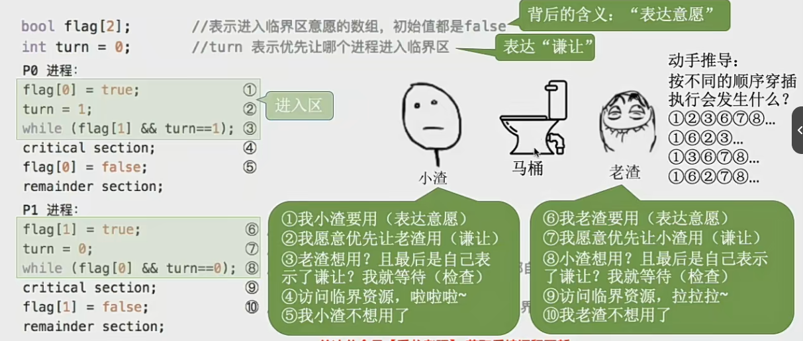

# 进程的同步和互斥

异步：异步是进程的特征，异步性是指，各并发执行的进程以格子独立的、不可预知的速度向前推进

进程同步：亦称直接制约关系，它是指为完成某种任务而建立的两个或多个进程，这些进程因为需要在某些位置上协调它们的工作次序而产生的制约关系。进程间的制约关系就是源于他们之间的相互合作。

进程互斥：进程的 并发 需要 共享 的支持。比如打印机、摄像头等，各个并发执行的进程不可避免的需要共享一些系统资源，所以进程在访问一些限制同时使用的资源的时候需要采取互斥共享方式

我们把一个时间段内只允许一个进程使用的资源称为临界资源。许多物理设备都属于临界资源。此外还有许多变量、数据、内存缓冲区等都属于临界资源

进程互斥的四个部分：
1. 进入区 - 检查是否可以进入临界区 对标上锁
2. 临界区 - 访问临界资源的那段代码
3. 退出区 - 解锁
4. 剩余区 - 剩余部分代码

互斥遵顼的原则：
1. 空闲让进
2. 忙则等待
3. 有限等待 - 要在有限的时间内进入，保证不会饥饿
4. 让权等待 - 进不了临界区的资源要释放处理及，防止忙等

# 进程互斥的软件实现方法

1. 单标志法
    算法思想：两个进程在访问完临界区后会把使用临界区的权限转让给另一个进程。也就是说每个进程进入临界区的权限只能被另一个进程赋予

    缺点：单标志法存在的最主要的问题是：违背了 空闲让进 的原则。因为单标志一开始要设置一个初始值，这个初始值可能是只允许A机器用不允许B机器用，然后A机器前面的逻辑还没处理完，但是B已经要用了，但是用不了，一定要等A用完给B用
2. 双标志先检查
    算法思想：设置一个布尔型的数组flag[],数组中各个元素用来标记各进程想要进入临界区的意愿，比如 flag[0] = true 代表 0 号进程想要进入临界区。每个进程在进入临界区前检查当前有没有别的进程想要进入临界区，如果没有则把自己的flag[i]设为true,之后开始访问临界区

    缺点：双标志后监察法的主要问题是违反了 "忙则等待" 的原则。因为进入区的检查和上锁两个处理不是一气呵成的。检查后，上锁前可能发生进程切换
3. 双标志后检查
    后检查法其实就是先上锁，也就是我们先改true 然后再去检查有没有其他的改true了

    缺点：双标志法虽然解决了忙则等待的问题，但是又违背了 空闲让进 和 有限等待 的原则，因为有可能两个同时改true 然后两个进程都无法访问临界资源而 “饿死”
4. Peterson算法
    结合双标志、单标志法的思想。如果双方都争着想进入临界区，就会让进程尝试 “谦让”


# 进程互斥的硬件实现方法
1. 中断屏蔽法
    原理：利用"开/关中断指令实现"(与原语的实现思想相同，即在某进程开始访问临界区到结束访问为止都不允许被中断，也就不能发生进程切换，因此也不可能发生两个同事访问临界区的情况)

    优点：简单、高校

    缺点：不适合多处理机，只适用于操作系统内核进程，不适用于用户进程

2. TestAndSet    TS指令/TSL指令
    有些地方也会叫做 TestAndSetLock 指令

    原理：是用硬件实现的，执行的过程不允许中断，必须一气呵成。下面用C语言描述一下逻辑

```c
// 布尔型共享变量 lock 表示当前临界区是否被加锁
// true 表示被加锁，false表示未加锁
bool TestAndSet(bool *lock){
    bool old;
    old = *lock;
    *lock = true;
    return old;
}

// TSL指令实现互斥
while (TestAndSet(&lock));
// 临界区代码
lock = false;
// 剩余代码
```
若刚开始`lock`是`false`,则TSL返回的 `old` 值为 `false`, `while` 循环条件不满足，直接跳过循环，进入临界区。若刚开始 `lock` 是 `true`, 则执行TLS后返回的值为true，while循环条件满足，一直循环，直到当前访问临界区的进程退出解锁。

相比软件的实现方法，TSL指令把 上锁 和 检查 操作用硬件方式变成了一气呵成的原子操作。

优点：实现简单，无需像软件实现方法那样严格检查是否有逻辑漏洞，适用于多处理机环境

缺点: 不满足 让权等待 原则，暂时无法进入临界区的进程会占用CPU循环执行TSL指令，从而导致 "忙等"。

3. Swap指令      XCHG指令
有的地方也叫 Exchange 指令 XCHG指令

swap指令是用硬件实现的，执行过程不允许中断，只能一气呵成。用C语言对逻辑进行描述
```c
// Swap 指令的作用是交换两个变量的值
Swap(bool *a, bool *b){
    bool temp;
    temp = *a;
    *a = *b;
    *b = temp;
}

// 一下是实现互斥的算法逻辑
// lock表示是否被加锁
bool old = true;
while (old == true) {
    Swap(&lock, &old);
}
// 临界区
lock = false;
// 剩余区

/*
逻辑上来看 Swap 和 TSL 并无太大区别，都是记录下此时临界区是否上锁，然后再将标记记为true，最后检查old。
如果old为false则说明之前没有别的进程对临界区上锁，则跳出循环进入临界区
*/
```
优点：实现简单，无需像软件实现方法那样严格检查是否有逻辑漏洞，适用于多处理机环境

缺点: 不满足 让权等待 原则，暂时无法进入临界区的进程会占用CPU循环执行TSL指令，从而导致 "忙等"。
