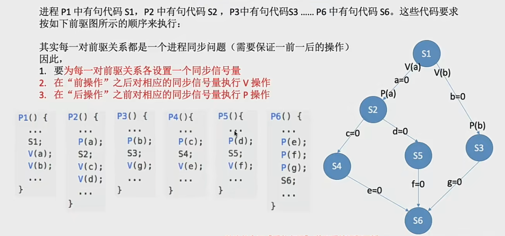

# 进程互斥-锁
## 互斥锁
解决临界区最简单的工具就是**互斥锁** mutex lock。一个进程再进入临界区时获得锁；再退出临界区进行释放锁。

acquire() -> 获得

release() -> 释放

每个互斥锁都有一个bool变量available，表示锁是否可用，如果可用则调用 acquire，并且锁不再可用。进程试图获取不可用的锁的时候，就会被阻塞，直到锁被释放

这里的 acquire 和 release 必须是原子操作，因此要通过硬件机制实现。

互斥锁主要的缺点是忙等待，当有一个进程在临界区中，任何其他进程在进入临界区时必须连续调用acquire。多个进程共享同一个CPU时，就会浪费CPU的周期。因此，互斥锁通常用于多处理系统，一个线程可以在一个处理器上等待而不影响其他线程的执行。

需要连续循环忙等的互斥锁都可以称为 **自旋锁** spin lock，如 TSL指令、Swap指令、单标志法

特性：
- 需忙等，进程时间片用完才会下处理及，违反 让权等待
- 优点：等待期间不用切换进程上下文，多处理器系统中，若上锁的时间段则等待代价很低
- 常用于多出力系统，一个核忙等，其他核照常工作，并快速释放临界区。
- 不太适用于单处理机系统，忙等的过程中不可能解锁

## 信号量
用信号量机制实现进程互斥、同步、前驱关系

一个信号量对应一种资源

信号量的值 = 这种资源的剩余数量(如果信号量的值小于0，说明此时有进程正在等待这种资源)

P(S) -- 申请一个资源S，如果资源不够就阻塞等待

V(S) -- 释放一个资源S,如果有进程正在等待，则唤醒一个进程

#### 信号量实现进程互斥
1. 划定临界区
2. 设置互斥信号量 mutex，初值为1 // 这个值表示的是能够进入临界区的名额
3. 进入区P(mutex) 申请资源
4. 退出区V(mutex) 释放资源 

不同的临界资源要设置不同的互斥信号量

#### 信号量实现进程同步
也就是让并发的进程按要求有序地推进

1. 分析在什么地方需要实现"同步关系"，即必须保证"一前一后"执行的两个操作(或两句代码)
2. 设置同步信号量S，初始为0
3. 在 前操作 之后执行 V(S)
4. 在 后操作 之前执行 P(S)

#### 信号量机制实现前驱关系

## 管程
信号量机制存在的问题：编写程序困难，容易出错

管程是一种特殊的软件模块，由这些部分组成:
1. 局部与管程的共享数据结构说明；
2. 对该数据结构进行操作的一组过程；
3. 对局部于管程的共享数据设置初始值的语句;
4. 管程有一个名字

过程其实就是函数

基本特征
1. 局部于管程的数据只能被局部于管程的过程所访问；
2. 一个进程只有通过调用管程内的过程才能进入管程访问共享数据；
3. 每次仅允许一个进程在管程内部执行某个内部过程

#### 管程解决生产者消费者问题
1. 需要在管程中定义共享数据 如生产者消费者问题中的缓冲区
2. 需要在管程中定义用于访问这些数据的 "入口" -- 其实就是一些函数
3. 只有通过这些 入口 才能访问共享数据
5. 设置变量条件以及等待/唤醒操作以解决同步问题，可以让一个进程或者线程在变量上等待，可以通过唤醒操作将在条件变量上等待的进程唤醒

# 死锁
#### 进程死锁、饥饿、死循环的区别
- 死锁：各进程互相等待对方手里的资源，导致各进程都阻塞，无法向前推进的现象
- 饥饿：由于长期等不到想要的资源，某进程无法向前推进的现象
- 死循环：某进程执行过程一直跳不出某个循环的现象

死锁一定是循环等待对方手里的资源导致的，所以发生死锁至少有两个进程同时发生死锁。死锁一定是阻塞态

饥饿可能是一个进程发生饥饿。既可能是阻塞态(等不到打印机)，也有可能是就绪态(分不到时间片)

死循环纯代码逻辑问题

#### 死锁产生的必要条件
1. 互斥条件：只有对必须互斥使用的资源的争抢才会导致死锁
2. 不可剥夺条件：进程所获得的资源再未使用完之前，不能由其他进程强行抢走，只能主动释放
3. 请求和保持条件：进程至少已经有了一个资源，但是又有新的资源请求，而该资源又被其他的进程占有，此时请求进程被阻塞，但又不会放开自己已有的资源
4. 循环等待条件：存在一种进程资源的循环等待链，链中的没一个进程已获得资源的同时被下一个进程所请求

！注意：发生死锁的时候一定有循环等待链，但是发生循环等待的时候不一定有死锁

#### 什么时候发生死锁
1. 对系统资源的竞争。各进程对不可剥夺的资源的竞争可能会引起死锁，但是对可剥夺的资源的竞争不会引起死锁
2. 进程推进顺序非法，请求和释放资源顺序不当，同样会导致死锁
3. 信号量的使用不当也会造成死锁

总之，对不可剥夺资源分配不合理的时候就会导致死锁
#### 死锁的处理策略
1. 预防死锁。破坏死锁产生的四个必要条件中的一个或几个
2. 避免死锁。用某种方法防止系统进入不安全状态，从而避免死锁 - 银行家算法
3. 死锁的检测和解除。允许死锁的发生，不过操作系统会负责检测出死锁的发生，然后采取某种措施解除死锁

## 预防死锁
1. 破坏互斥条件
如果把只能互斥使用的资源改造为允许共享使用，则系统不会进入死锁状态。如SPOLLing技术。操作系统采用这个技术可以采用SPOOLing技术把独占设备在逻辑上改造成共享设备。

缺点：并不是所有资源都可以改为共享资源，并且为了系统安全有些情况下必须保护这种互斥性。因此很多时候没办法破坏互斥条件

2. 破坏不剥夺条件
方案一：当某个进程请求新资源但是得不到满足的时候，它必须立即释放当前的资源，等到后面有需要的时候重新申请。

方案二：当某个进程需要的资源被其他进程占用的时候，可以由操作系统协助将想要的资源强行剥夺。这种方式一般要考虑到各个进程的优先级

缺点
- 实现起来比较复杂
- 释放已经获得的资源可能会导致前一段工作的失效。因此这种方法只能适用于容易保存和回复状态的资源，比如CPU
- 反复申请释放资源会增加系统开销，降低吞吐量
- 如果用方案一，只要得不到一个资源就会一直放弃自己的资源，变成饥饿

3. 破坏请求和保持条件
可以采用静态分配方法，即在进程运行前一次性申请所有的资源，在资源没有得到满足前不让它投入运行。

实现起来简单，但是也有明显缺点：
有些资源可能只需要很短的时间，因此如果进程的整个运行期间一直保持所有资源就会造成严重的资源浪费，资源利用低。另外，也有可能导致某些进程饥饿

4. 破坏循环等待条件
可以采用顺序资源分配法，给系统中的资源编号，每个进程必须按照编号递增的顺序请求资源。

原理分析：一个进程只有已经有了小编号资源的时候，才能申请更大编号的资源，以此类推。有大编号资源的进程不会再回头申请小编号的资源，就不会产生循环等待的条件

缺点：
- 不方便增加新的设备，因为可能需要重新给资源编号
- 进程实际使用资源的顺序可能和编号递增顺序不一致，会导致资源的浪费
- 必须按照次序申请资源，用户编程麻烦

## 避免死锁
- 不允许死锁发生
1. 静态策略 预防死锁
2. 动态策略 避免死锁
3. 允许发生 死锁的检测和解除

这里我们讲得就说避免死锁
- 什么是安全序列

所谓安全序列就是如果系统按照这种序列分配资源，则每个进程都能顺利完成。只要能找到一个安全序列，系统就是安全状态。安全序列可能有多个

- 什么是系统的不安全状态，与死锁的联系

如果分配了资源之后，系统就找不出任何一个安全序列，就代表系统进入了不安全状态。意味着之后可能所有进程都无法顺利的执行下去。当然，如果有进程提前归还了一些资源，那系统也有可能重新回到安全状态，不过我们再分配资源前总是要考虑到最坏的情况

如果处于安全装填就一定不会发生死锁，如果进入不安全状态就有可能发生死锁

- 如何避免系统进入不安全状态 - 银行家算法

核心思想：在进程提出资源申请的时候，先预判这次分配是否会导致系统进入不安全状态。如果会进入不安全状态就暂时不答应这次请求，让进程先阻塞等待。

1. 检查此次申请是否超过了之前声明的最大需求数
2. 检查此时系统剩余的可用资源是否还能满足这次请求
3. 试探着分配，更改各数据结构
4. 用安全性算法检查此次分配是否会导致系统进入不安全状态

安全性算法步骤
- 检查当前剩余资源能否满足某个进程的最大需求，如果可以，就把该进程加入安全序列，并把该进程持有的资源全部回收
- 不断重复上述过程，看最终是否能让所有进程都加入安全序列

## 死锁的检测和解除
#### 死锁的检测
- 用某种数据结构来保存资源的请求和分配信息
- 提供一种算法，利用上述信息来检测系统是否已经进入死锁状态

数据结构： 资源分配图

两种结点
1. 进程结点：对应一个进程
2. 资源结点：对应一类资源

两种边
1. 进程结点 -> 资源结点：表示进程想申请几个资源   每条边代表一个
2. 资源节点 -> 进程结点：表示已经为进程分配了多少个资源

#### 死锁的解除
1. 资源剥夺法。挂起(暂时放到外存上)某些死锁进程，并抢占它的资源，将这些资源分配给其他的死锁进程。但是应防止被挂起的进程长时间得不到资源而饥饿
2. 撤销进程法。强制撤销部分、甚至全部死锁进程，并剥夺这些进程的资源。这种方式的优点是实现简单，但复出的代价可能会很大，因为有些进程可能已经运行了很长时间，已经接近结束了
3. 进程回退法。让一个或者多个进程回退到足以避免死锁的地步。这就要求系统要记录进程的历史信息，设置还原点

