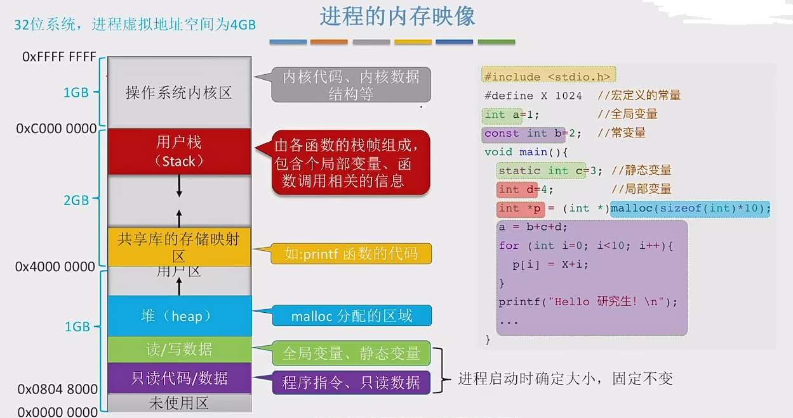
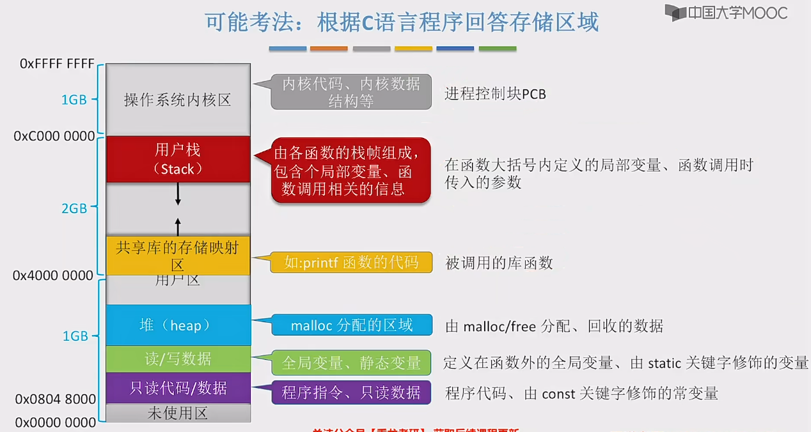
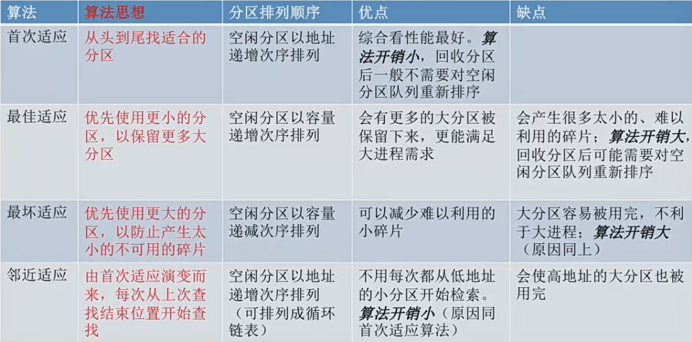

# 内存的基本知识

内存是用来存放数据的，程序执行前需要加载到内存中才能被CPU进行处理 -- 缓和CPU与硬盘之间的速度矛盾

内存中也有很多个存储单元，同样的会对应内存地址，内存地址从0开始，每个地址对应一个存储单元

### 三种装入策略
1. 绝对装入
在编译的时候，如果知道程序存放在内存的哪个位置，编译程序将产生绝对地址的目标代码。装入程序按照装入模块中的地址，将程序和数据装入内存。

只适用于单道程序环境

2. 可重定位装入(静态重定位)
编译、连接后的装入模块的地址都是从0开始的，指令中使用的地址、数据存放的地址都是相对于起始地址而言的逻辑地址。可以根据内存当前的情况，将模块装入道内存的适当位置。装入时对地址进行“重定位”，将逻辑地址转为物理地址

静态重定位特点是在一个作业装入内存时，必须分配其要求的全部内存空间，如果没有足够的内存，就不能装入该作业

3. 动态运行时装入(动态重定位)
编译、连接后的装入模块地址都是从0开始的。装入程序把装入模块装入内存后，并不会立即把逻辑地址转换为物理地址，而是把地址转换推迟到程序真正要执行时才会进行。因此装入内存后所有的地址依然是逻辑地址。这种方式需要一个重定位寄存器的支持

采用动态重定位允许程序再内存中发生移动

链接的三种方式
1. 静态链接：再程序运行前，先将各目标模块以及他们所需的库函数连接成一个完整的可执行文件，之后不再拆开
2. 动态链接：将目标模块装入内存，边装入边链接的链接方式
3. 运行时动态链接：在程序执行中需要该目标模块才对它进行连接。优点是便于修改和更新，便于实现对目标模块的共享

## 内存管理的概念
1. 内存空间的分配与回收

2. 内存空间的扩充

3. 地址转换 - 负责程序的逻辑地址与物理地址的转换

4. 存储保护
保证各个进程在自己空间内运行，不越界

内存保护可采取的两种方法
- 方法一：在CPU中设置一堆上、下限寄存器，存放进程的上、下限地址，进程的指令要访问某个地址时，CPU检查是否越界
- 方法二：采用重定位寄存器(基地址寄存器)和界地址寄存器(限长寄存器)进行越界检查，重定位寄存器中存放的是进程的起始物理地址。界地址寄存器存放的是进程的最大逻辑地址

## 进程的内存映像

## 内存空间的扩充

1. 覆盖技术
覆盖技术用来解决：当程序大小超过物理内存总和的问题

覆盖技术的思想： 将程序氛围多个段落 或者说多个模块。常用的段常驻内存，不常用的段在需要的时候调入内存

内存中分为一个 “固定区” 和 若干个 “覆盖区”。

需要常驻内存的放在固定区，调入后就不再调出，除非运行结束。

不常用的段放在覆盖区，需要用到的时候调入内存，用不到时调出内存

2. 交换技术
交换技术的思想：内存空间紧张的时候，系统将内存中某些进程暂时换出外存，把外存中某些已经具备运行条件的进程换入内存(进程在内存与磁盘间动态调度)

- 具有交换功能的操作系统中，通常把磁盘空间分为文件区和对换区两部分。文件区主要用于存放文件，主要追求存储空间的利用率，因此对文件空间的管理采用离散分配方式；兑换去空间只占磁盘空间的小部分，被换出的进程数据就存放在对换区。由于对换的速度直接影响到系统的整体速度，因此对换区空间的管理主要追求换入换出速度，因此通常对换区采用连续分配方式。总之就是对换区I/O速度比文件区更快。
- 交换通常在许多进程运行且内存吃紧的时候进行，而系统负载降低就会暂停。
- 可优先换出阻塞进程；可换出优先级比较低的进程；为了防止优先级低的进程在被调入内存后又被换出，有些系统会考虑进程在内存的驻留时间

PCB会常驻内存，不会被换出外存

3. 虚拟技术
虚拟技术单启一块

## 内存空间的分配与回收
#### 连续分配管理
1. 单一连续分配
在单一连续分配方式中，内存分为系统区和用户区。

系统区通常位于内存的低位地址部分，用于存放操作系统相关数据；用户去用于存放用户进程相关数据。
内存中只能有一道用户程序，而用户程序独占整个用户区空间

优点: 实现简单，无外部碎片。可采用覆盖技术扩充内存；不一定需要采取内存保护

缺点: 只能用于单用户、单任务的操作系统中；有内部碎片；存储器利用效率极低

2. 固定分区分配
为了能在内存中装入多道程序，且这些程序之间又不会互相干扰，于是将整个用户空间划分为若干个大小固定的分区，在每个分区中只装入一道作业，这样就形成了最早的、最简单的一种可运行多道程序的内存管理式

- 分区大小相等
缺乏灵活性，但撒很适用于用一台计算机控制多个相同对象的场合

- 分区大小不等
增加了灵活性，可以满足不同大小的进程需求。根据常在系统中运行的作业大小情况进行划分

操作系统需要建立一个数据结构 - 分区说明表，来实现各个分区的分配与回收。每个表项对应一个分区，通常按分区大小排列。每个表项包括对应分区的大小、起始地址、状态(是否分配)

优点： 实现简单，无外部碎片

缺点：a.当用户程序太大，可能所有分区都不能满足需求，此时就要采用覆盖技术来解决，这就会降低系统性能 b.会产生内部碎片，内存利用率低

3. 动态分区分配
动态分区分配又称为可变分区分配。这种分配方式不会预先划分内存分区，而是在进程装入内存时，根据进程的大小动态地建立分区，并使分区的大小正好适合进程的需要。因此系统分区的大小和数目是可变的。

常用**空闲分区表**和**空闲分区链**两种数据结构来记录动态分区的内存使用情况

把一个新作业装入内存的适合，必须按照一定的动态分区分配算法，从空闲分区表中选出一个分区分配给这个作业

分区的分配和回收
- 情况一：回收区后面有一个相邻的空闲分区，回收的时候要把相邻的空闲分区进行合并
- 情况二：会收取前面有个相邻的空闲分区，同上
- 情况三：前后都有一个相邻的空闲分区，同上 也是合并
- 情况四：前后都没有空闲分区，直接增加表项或者链结点

动态分区分配没有内部碎片，但撒有外部碎片
内部碎片：分配给某进程的内存区域中如果有些部分没有用上
外部碎片：是指内存中的某些空闲分区由于太小而难以利用

如果内存中空闲空间的总和本来是可以满足进程需求的，但撒由于进程需要一整块连续的内存空间，因此这些"碎片"不能满足进程需求，可以通过紧凑(拼凑 Compaction)技术来解决外部碎片

###### 动态分区分配算法
前提：在动态分区分配算法中，如果很多个空闲分区都能满足需求的时候，我们应该选择哪个分区进行分配？
1. 首次适应算法 First Fit
算法思想：每次从低地址开始查找，找到第一个能满足大小的空闲分区

实现：空闲分区以地址递增的次序排列，每次分配内存的时候顺序查找空闲分区链或者空闲分区表，找到大小满足要求的第一个分区

2. 最佳适应算法 Best Fit
算法思想：由于动态分区分配是一种连续的分配方式，为各进程分配的空间必须是连续的一整片区域。因此为了保证当大进程到来时能有连续的大片空间，可以尽可能多地留下大片空闲区，即优先使用更小的空闲区

实现：空闲分区按容量递增次序链接。每次分配内存时顺序查找空闲分区链/表，找到大小能满足要求的第一个空闲分区

缺点：每次都选最小的分区进行分配，会留下越来越多的、很小的、难以利用的内存块碎片

3. 最坏适应算法 Worst Fit
又称为最大适应算法 Largest Fit

算法思想：为了解决最佳适应算法的问题，可以每次分配的时候使用最大的连续空闲区

实现：空闲分区按容量递减次序链接，每次分配内存的时候顺序查找空闲分区链/表，只用判断第一个是否能满足要求即可

缺点：每次都选最大的分区进行分配，虽然让留下的空闲区更大，更可用，但大的连续空间用完，后面如果又"大进程"到来就没有内存分区可用了

4. 邻近适应算法 Next Fit
算法思想：首次适应算法每次都从链头开始查找。这可能会导致低地址部分出现很多小的空闲分区，而每次分配查找时都要金国这些分区，因此也增加了查找的开销。如果每次都从上次结束的位置开始检索，就会解决上述问题

实现: 空闲分区以地址递增的顺序排列。(循环链表)。每次分配内存时从上次查找结束的位置开始查找空闲分区链/表，找到大小满足要求的第一个空闲分区

邻近适应算法又最佳适应算法的优点和最大适应算法的缺点

#### 非连续分配管理

