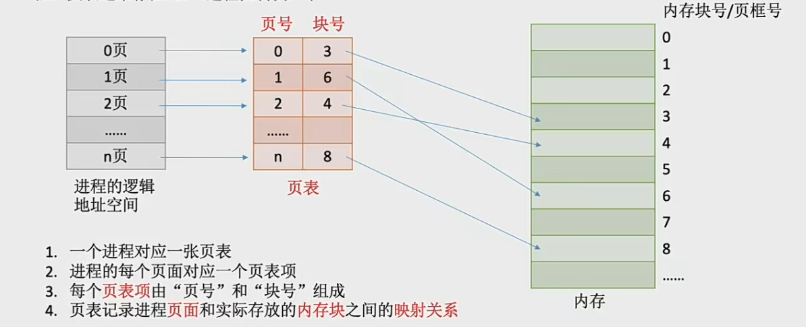
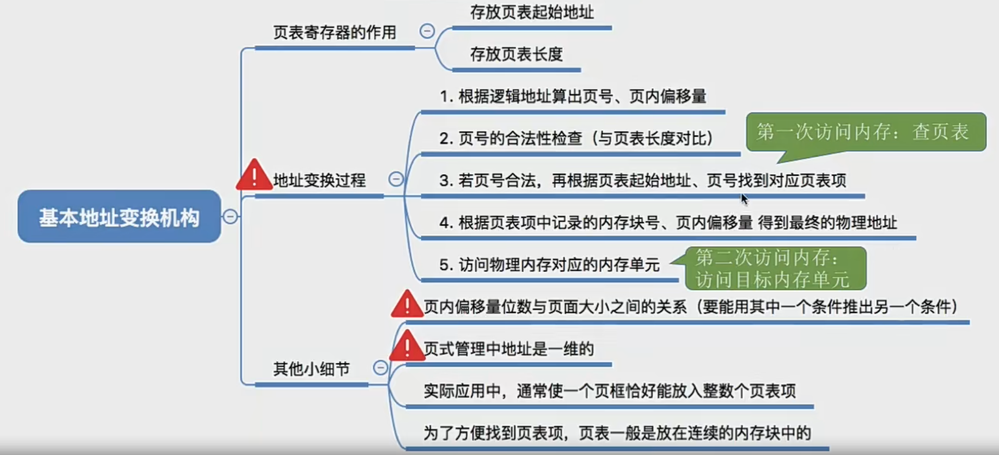
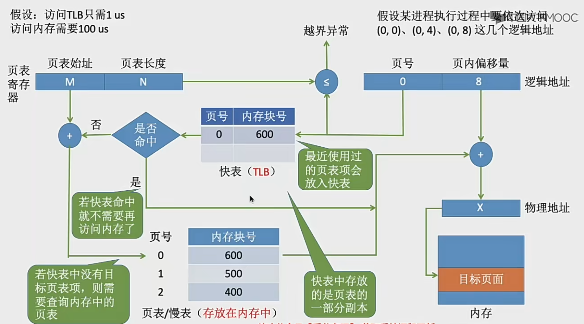
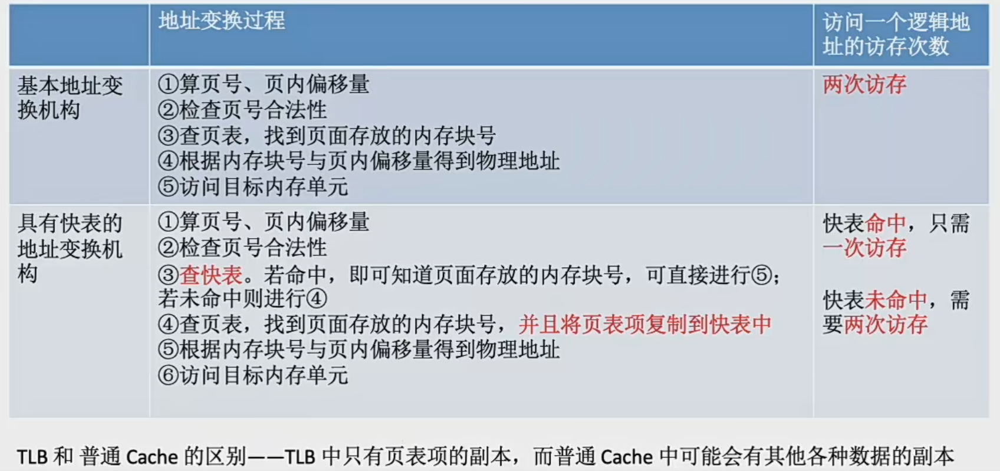
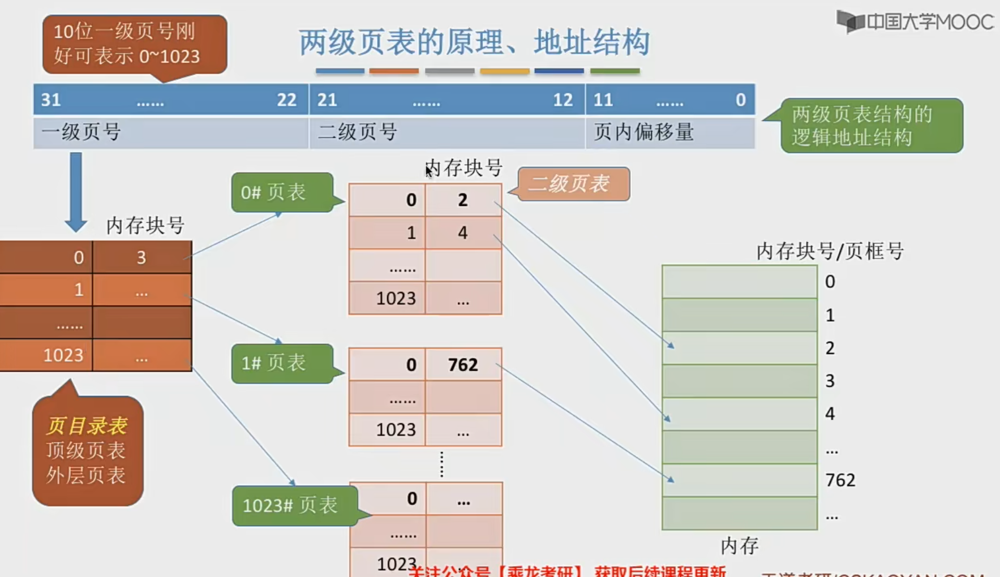
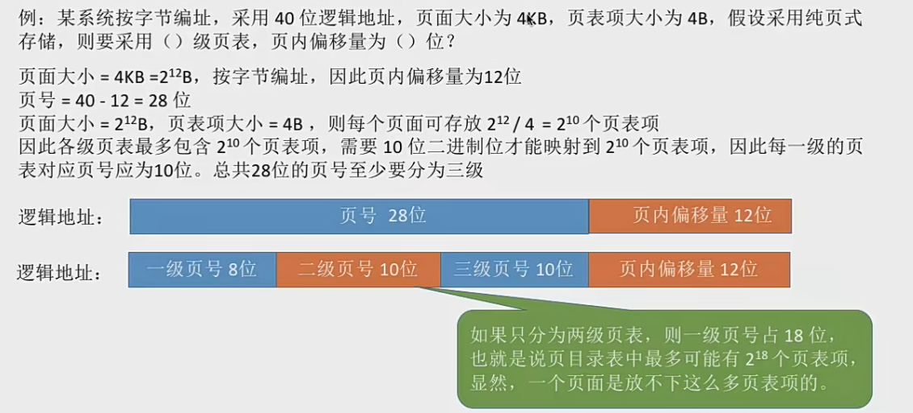
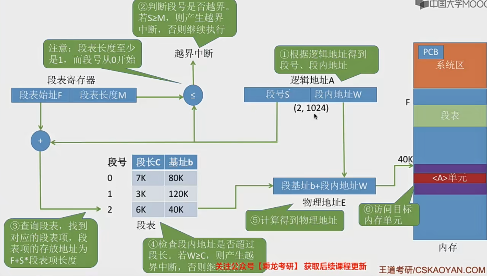
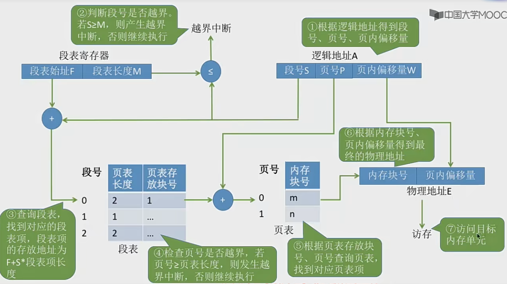

# 非连续分配管理方式
给用户进程分配的可用是一些分散的内存空间
### 基本分页存储管理
- 什么是分页存储
将内存分为一个个大小相等的分区，每个分页就是一个`"页框"`(`页框`=`页帧`=`内存块`=`物理块`=`物理页面`)。每个页框都有一个编号，也就叫做`"页框号"`（页框号 = 页帧号 = 内存块号 = 物理块号 = 物理页号），页框号从0开始

将进程的逻辑地址空间也分为与页框大小相等的一个个部分，每个部分称为一个 页 或者 页面 。每个页面也有一个编号就是页号，页号也从0开始

操作系统以页框为单位为各个进程分配内存空间。进程的每个页面放入一个页框中。也就是说，进程的页面与内存的页框有一一对应的关系。

各个页面不必连续存放，可用存放到不相邻的各个页框中。

- 重要的数据结构 - 页表
为了能知道进程每个页面在内存中的存放位置，操作系统要为每个进程建立一张页表



1. 问题1：每个页表项占多少个字节？

假设内存大小 4GB, 页面大小 4KB, 则每个页表项至少应该多少字节？

内存块大小=页面大小=4KB=2^12 B
-> 4GB = 2^32 B, 4GB/4KB = 2^20 个内存块
-> 内存块号范围 0-2^20 - 1
-> 内存块号至少要 20bit 来表示
-> 至少要用 3 Byte 来表示块号,假设有 0-n页，存储整个页表至少要 3*(n+1)B

然后页表项是连续存放的，所以页号是可用不用站存储空间的，直接用数组下标的形式来标记页号

！注意：这里只记录的是内存块号，而不是内存块的起始地址。 j号内存块的其实地址 = j * 内存块大小

假设页表中的各项表项从内存地址为x的地方开始连续存放，要找到页号为i的页表项，存放地址 = x + 3*i

2. 问题2： 如何实现地址转换
如果要访问逻辑地址A对应的页号P
>   1. 确定逻辑地址A对应的页号P
>   2. 找到P号页面在内存中的起始地址(查页表)
>   3. 确定逻辑地址A的"页内偏移量"W
>
>   逻辑地址A对应的物理地址 = P号页面在内存中的起始地址+页内偏移量
>   
>   页号 = 逻辑地址/页面长度    地板除
>   页内偏移量 = 逻辑地址 % 页面长度    取余

- 基本分页存储管理 - 基本地址变换机构(用于实现逻辑地址到物理地址转换的一组硬件机构)的原理和流程
基本地址变化机构可以借助进程的页表将逻辑地址转为物理地址。

通常会在系统中设置一个页表寄存器(PTR),存放页表在内存中的起始地址F,和页表长度M。进程未执行的时候，页表的起始地址和页表长度放在PCB中，当进程被调度的时候，操作系统内核会把它们放到页表寄存器中

这里一共完成了这些事情
1. 首先根据逻辑地址计算出页号和页内偏移量
2. 判断页号是否越界(通过页表寄存器判断)
3. 查询页表找到对应的页表项，确定页面存放的内存块号
4. 用内存块号和页内偏移量得到物理地址
5. 访问目标内存单元



- 具有快表的地址变换机构
是基本地址变换机构的改进版本
1. 什么是快表 TLB
快表，又称为联想寄存器(TLB, translation lookaside buffer), 是一种访问速度比内存快很多的高速缓存(TLB不是内存！)，用来存放最近访问的页表项的副本，可以加速地址变换的速度。与此对应，内存中的页表常称为慢表。


2. 引入快表后，地址的变换过程


> - CPU给出逻辑地址，由某个硬件算得页号、页内偏移量，将页号与快表中的所有页号进行比较。
> - 如果找到匹配的页号说明访问的页表项在快表中有副本，则直接从中取出该页对应的内存块号，再将内存块号与页内偏移量拼接形成物理地址，最后访问该物理地址的内存单元。因此，若快表命中，则访问某个逻辑地址仅需一次访存即可。
> - 如果没有找到匹配的页号，则需要访问内存中的页表，找到对应的页表项，得到页面存放的内存块号，再将内存块号与页内偏移量拼接形成物理地址，最后，访问该物理地址对应的内存单元。因此，若快表未命中，则访问某个逻辑地址需要 两次访存(注意：找到页表项后要记得存入快表，快表存满了就要用一定算法淘汰旧页表项进行替换)

3. 局部性原理
时间局部性：如果执行了程序中的某条指令，那么不久后这条指令很可能再次被执行；如果某个数据被访问过，不久后该数据很有可能再次被访问(循环)
```c
int i = 0;
int a[100];
while (i < 100) {
    a[i] = i;
    i++;
}
```
空间局部性：一旦程序访问量某个存储单元，在不久后，在其附近的存储单元很有可能被访问。(因为很多数据在内存中都是连续存放的)

基本地址变换机构中，每次要访问一个逻辑地址都需要查询内存中的页表。由于局部性原理，可能连续很多次查到的都是同一个页表项


###### 两级页表

1. 单级页表存在什么问题？如何解决？
- 问题一：页表必须连续存放，因此当页表很大时，需要占用很多个连续的页框
- 问题二：没有必要让整个页表常驻内存，因为进程在一段时间内可能只需要访问某几个特定的页面

2. 两级页表的原理、逻辑地址结构


3. 如何实现地址变换
>   1. 按照地址结构将逻辑地址拆分成三个部分
>   2. 从PCB中读出页目录表起始地址，再根据一级页号查页目录表，找到下一级页表再内存中的存放位置
>   3. 根据二级也好查表，找到最终像访问的内存块号
>   4. 结合页内偏移量找到物理地址
>


4. 两级页表问题需要注意的几个细节
>   1. 若采用多级页表机制，则各级页表大小不能超过一个页面

>   2. 两级页表的访存分析次数(假设没有快表)
第一次访存：访问内存中但页目录表
第二次访存：访问内存中的二级页表
第三次访存：访问目标内存单元

### 基本分段存储管理
与分页最大的区别就是离散分配时所分配地址空间的基本单位不同

1. 什么是分段 - 类似于分页管理中的分页
进程的地址空间：按照程序自身的逻辑关系划分为若干个段，每个段都有一个段名(低级语言中，程序员通过使用段名来编程)，每段从0开始编址

内存分配规则：以段为单位分配，每个段在内存中占据连续空间，但各段之间可以不相邻

因为是逻辑功能模块划分，用户编程更方便，程序可读性更高

分段系统的逻辑地址结构由段号(段名)和段内地址(段内偏移量)所组成。

段号的位数决定了每个进程最多可以分几个段，段内地址位数决定了每个段的最大长度是多少

2. 什么是段表 - 类似于分页管理中的页表
程序分为多个段，离散地装入内存，为了保证程序能正常运行，就必须能从物理内存中找到各个逻辑段存放的位置，所以要为每个进程建立一张段映射表，建成段表

- 每个段对应一个段表项，其中记录了该段在内存中的起始位置，又称为基址，还要记录段的长度
- 各个段表项的长度是相同的。

3. 如何实现地址变换


4. 分段、分页管理的对比
- 
页 是信息的物理单位。分页的主要目的是为了实现离散分配而提高内存利用率。分页仅仅是系统管理上的需要，完全是系统行为，对用户是不可见的。

段 是信息的逻辑单位。分段的主要目的是更好地满足用户需求。一个段通常包含着一组属于一个逻辑模块的信息。分段对用户是可见的。用户编程时需要显式地给出段名

- 
页的大小是固定的，是由系统决定的。但撒段的长度不固定，取决于用户编写的程序。

- 
分页的拥护进程地址空间是一维的，程序员只需要给出一个记忆符即可表示一个地址

分段的用户进程地址空间是二维的，程序员在标识一个地址的时候既要给出段名，又要给出段内地址

- 
分段比分页更容易实现信息的共享和保护。
不能被修改的代码称为纯代码或者可重入代码，它们不属于临界资源，这样的代码是可以共享的。可修改的代码是不能共享的

### 段页式存储管理
1. 分页、分段管理方式中最大的优缺点


2. 分段+分页的结合 -- 段页式管理方式
说白了就是先将进程的逻辑模块分段，然后再将各段进行分页

这种方式的逻辑地址结构就变成了：段号、页号、页内地址(页内偏移量)组成
段号的位数决定了每个进程可以分几个段

页号位数决定了每个段最大由多少页

页内偏移量决定了页面大小、内存块大小是多少

3. 段表、页表

4. 如何实现地址变换

