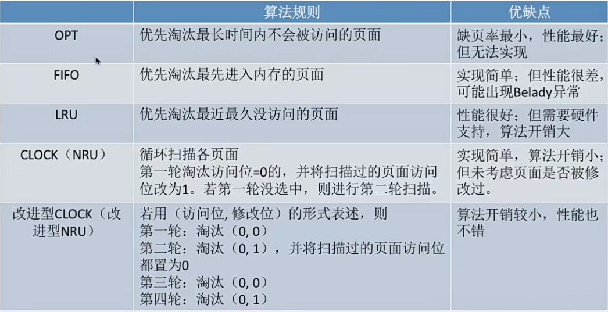

# 虚拟内存

### 传统存储管理方式的特征、缺点
很多暂时用不到的数据也会长期占用内存，导致内存利用率不高

一次性：作业必须一次性全部装入内存后才能开始运行。这会造成两个问题: 1. 作业很大的时候，不能全部装入内存，导致大作业无法运行。2. 当大量作业要求运行时，由于内存无法容纳所有作业，因此只有少量作业能运行，导致多道程序并发度下降

驻留性：一旦作业装入内存，就会一直驻留内存，直到进程结束

### 局部性原理
1. 时间局部性：如果执行了程序中的某条指令，那么不久后就很有可能再次执行；如果某个数据被访问过，不久后该数据可能会被再次访问

2. 空间局部性：一旦程序访问了某个存储单元，在不久后其附近的单元也很有可能被访问

3. 高速缓存技术：

### 虚拟内存的定义和特征
基于局部性原理，在程序装入的时候，可以将程序中很快就会用到的部分装入内存，暂时用不到的部分留在外存，就可以让程序开始执行

在程序执行过程中，当访问的信息不在内存时，由操作系统负责将所需信息从外存调入内存，然后继续执行程序

若内存空间不够，操作系统会将内存中暂时用不到的信息换出到外存

在操作系统的管理下，在用户看来似乎有一个比实际内存大得多的内存，这就是虚拟内存。

虚拟内存主要由以下三个主要特征：
1. 多次行：无序在作业运行时一次性全部装入内存，而是允许被分为多次调入内存
2. 对换性：在作业运行时无需一直常驻内存，而是允许在作业运行过程中，将作业换入换出
3. 虚拟性：逻辑上扩充了容量，用户的使用感内存比实际大

### 如何实现虚拟技术
虚拟内存技术，允许一个作业分多次调入内存。如果采用连续分配方式，会不方便实现。因此，虚拟内存的实现需要建立在离散分配的内存管理方式基础上。

1. **请求分页存储管理**
2. 请求分段存储管理
3. 请求段页式存储管理

主要区别：
在程序执行过程中，当所访问的信息不在内存时，由操作系统负责将所需信息从外存调入内存，然后执行程序。若内存空间不够，由操作系统负责将内存中暂时用不到的信息换出到外存。

### 请求分页存储管理
请求分页存储管理与分页存储管理的区别：
- 在程序执行过程中，当所访问的信息不在内存的时候，由操作系统负责将所需信息从外村调入内存，然后继续执行程序。
- 若内存空间不够，由操作系统负责将内存中暂时用不到的信息换出外存

缺页中断：假设此时要访问的页面不在内存的时候，就产生了一个缺页中断，然后由操作系统的缺页中断处理程序处理中断。此后却也的进程阻塞，放入阻塞队列，调页完成后再将其唤醒，放回就绪队列。

如果页面由空闲块，就给进程分配一个空闲块，将所缺页面装入内存块，并修改页表中对应的页表项

如果内存中没有空闲块，则由页面置换算法淘汰一个页面，若淘汰的页面在内存期间被修改过，就要将其写回外存。未修改过的页面不用写回外存。

##### 页面置换算法
页面的换入换出需要磁盘I/O,会有比较大的开销，因此好的页面置换算法应该追求更少的缺页率

1. 最佳置换算法 OPT：每次选择淘汰的页面将是以后永不使用，或者在最长时间内不再被访问的页面，这样可以保证最低的缺页率。

2. 先进先出置换算法 FIFO：每次选择淘汰的页面是最早进入内存的页面

Belady异常 -- 当为进程分配的物理块数增大的时候，缺页次数不减反增的异常现象。

只有FIFO算法会产生Belady异常。虽然FIFO算法实现简单，但算法与实际运行时的规律不合适，因为先进入的页面也有可能最经常被访问，因此算法性能差

3. 最近最久未使用置换算法 LRU
每次淘汰的页面是最近醉酒未使用的页面。实现方法：赋予每个页面对应的页表项中，用访问字段记录该页面自上次被访问以来所经历的时间t。当需要淘汰一个页面时，选择现有页面中t值最大的，即最近最久未使用的页面

性能好，实现困难，开销大

4. 时钟置换算法 CLOCK
是一种性能和开销较均衡的算法

简单的CLOCK算法实现：为每个页面设置一个访问位，再将内存中的页面通过连接指针链接成一个循环队列。当某页要被访问的时候，其访问位置为1。当需要淘汰一个页面时，只需检查页的访问位。如果是0，就选择将该页换出，如果是1，就将它置为0，暂不换出，继续检查下一个页面，若第一轮扫描中所有页面都是1，则将这些页面的访问位依次置为0，在进行第二轮扫描

5. 改进型的时钟置换算法
上面提到的简单的时钟置换算法仅考虑到了一个页面是否被访问过。事实上，如果被淘汰的页面没有被修改过，就不需要执行I/O操作写回外存。只有淘汰的页面被修改过才需要写回外存。

我们增加一个修改位的判断就行了

第一轮：扫描找 (0,0)  不修改标志位
第二轮：扫描 找到第一个(0, 1).本轮将所有扫描过的帧访问位设为0
第三轮：若第二轮扫描失败，则重新扫描，找到第一个(0,0)用于替换，不修改标志位
第四轮: 扫描，找到第一个(0,1) 用于替换，不修改标志位

最多四轮扫描

### 页面分配策略
驻留集：指请求分页存储管理中给进程分配的物理块的集合

在采用了虚拟存储技术中，驻留集大小一般小于进程的总大小

固定分配:操作系统为每个进程分配一组固定数目的物理块，在进程运行期间不再改变。即，驻留集大小不变

可变分配:先为每个进程分配一定数目的物理块，在进程运行期间，可根据情况做适当的增加或减少即，驻留集大小可变

局部置换:发生缺页时只能选进程自己的物理块进行置换。

全局置换: 可以将操作系统保留的空闲物理块分配给缺页进程，也可以将别的进程持有的物理块置换到外存，再分配给缺页进程。

##### 页面分配、置换策略
1. 固定分配局部置换
固定分配局部置换:系统为每个进程分配一定数量的物理块，在整个运行期间都不改变。若进程在运行中发生缺页，则只能从该进程在内存中的页面中选出一页换出，然后再调入需要的页面。这种策略的缺点是:很难在刚开始就确定应为每个进程分配多少个物理块才算合理。 (采用这种策略的系统可以根据进程大小、优先级、或是根据程序员给出的参数来确定为一个进程分配的内存块数)

2. 可变分配全局置换
可变分配全局置换:刚开始会为每个进程分配一定数量的物理块。操作系统会保持一个空闲物理块队列。当某进程发生缺页时，从空闲物理块中取出一块分配给该进程:若已无空闲物理块，则可选择一个未锁定的页面换出外存，再将该物理块分配给缺页的进程。采用这种策略时，只要某进程发生缺页都将获得新的物理块，仅当空闲物理块用完时，系统才选择一个**未锁定**的页面调出。被选择调出的页可能是系统中任何一个进程中的页，因此这个被选中的进程拥有的物理块会减少，缺页率会增加。

这里的未锁定：系统会锁定一些页面，这些页面中的内容不能置换出外存，比如重要的内核数据这些

3. 可变分配局部置换
可变分配局部置换:刚开始会为每个进程分配一定数量的物理块。当某进程发生缺页时，只允许从该进程自己的物理块中选出一个进行换出外存。如果进程在运行中频繁地缺页，系统会为该进程多分配几个物理块，直至该进程缺页率趋势适当程度:反之，如果进程在运行中缺页率特别低，则可适当减少分配给该进程的物理块。

##### 何时调入页面？
1. 预调页策略:根据局部性原理，一次调入若干个相邻的页面可能比一次调入一个页面更高效。但如果提前调入的页面中大多数都没被访问过，则又是低效的。因此可以预测不久之后可能访问到的页面，将它们预先调入内存，但目前预测成功率只有50%左右。故这种策略主要用于进程的首次调入，由程序员指出应该先调入哪些部分。

2. 请求调页策略: 进程在运行期间发现缺页时才将所缺页面调入内存。由这种策略调入的页面一定会因此I/0开销较大。被访问到，但由于每次只能调入一页，而每次调页都要磁盘I/O操作，因此I/O消耗较大。

##### 何处调入页面？
1. 系统拥有足够的对换区空间:页面的调入、调出都是在内存与对换区之间进行，这样可以保证页面的调入、调出速度很快。在进程运行前需将进程相关的数据从文件区复制到对换区.

2. 系统缺少足够的对换区空间:凡是不会被修改的数据都直接从文件区调入，由于这些页面不会被修改，因此换出时不必写回磁盘，下次需要时再从文件区调入即可。对于可能被修改的部分，换出时需写回磁盘对换区，下次需要时再从对换区调入.

3. UNIX 方式:运行之前进程有关的数据全部放在文件区，故未使用过的页面，都可从文件区调若被使用过的页面需要换出，则写回对换区，下次需要时从对换区调入

##### 抖动 颠簸 现象
刚刚换出的页面马上又要换入内存，刚刚换入的页面马上又要换出外存，这种频繁的页面调度行为称为抖动，或颠簸。产生抖动的主要原因是进程频繁访问的页面数目高于可用的物理块数(`分配给进程的物理块不够`)

为了研究应该分配多少物理块，就提出了工作集的概念。

驻留集:指请求分页存储管理中给进程分配的内存块的集合
工作集:指在某段时间间隔里，进程实际访问页面的集合

工作集大小可能小于窗口尺寸，实际应用中，操作系统可以统计进程的工作集大小，根据工作集大小给进程分配若千内存块。如:窗口尺寸为5，经过一段时间的监测发现某进程的工作集最大为3，那么说明该进程有很好的局部性，可以给这个进程分配3个以上的内存块即可满足进程的运行需要。

一般来说驻留集的大小不能小于工作集的大小，否则运行过程中就会出现频繁缺页的现象

### 内存映射文件
内存映射文件一一操作系统向上层程序员提供的功能(系统调用)

- 方便程序员访问文件数据
- 方便多个进程共享同一个文件

传统的文件访问方式：
open系统调用一一打开文件
seek 系统调用一一将读写指针移到某个位置
read 系统调用一一从读写指针所指位置读入若干数据(从磁盘读入内存)
write 系统调用一一将内存中的指定数据，写回磁盘(根据读写指针确定要写回什么位置)

内存映射文件的访问方式：
open系统调用-一打开文件
mmap系统调用一一将文件映射到进程的虚拟地址空间

- 以访问内存的方式访问文件数据
- 文件数据的读入、写出由操作系统自动完成
- 进程关闭文件时，操作系统自动将文件被修改的数据写回磁盘

内存映射文件可以实现多个进程映射同一个文件，实现共享

在物理内存中，一个文件对应同一份数据，当一个进程修改文件数据的时候，另一个进程就能立马感知到