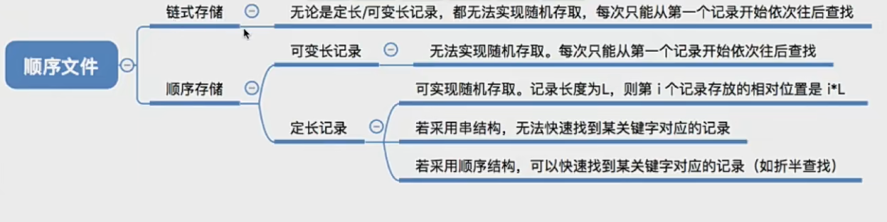

文件 就是一组有意义的信息/数据集合

## 文件的属性
1. 文件名：由创建文件的用户决定文件名，主要是为了方便用户找到文件，同一目录下不允许重名文件。
2. 标识符：一个系统内的各文件标识符唯一，对用户来说毫无可读性，因此标识符只是操作系统用于区分各个文件的一种内部名称
3. 类型：指明文件类型
4. 位置:文件存放的路径(让用户使用)在外存中的地址(操作系统使用，对用户不可见)
5. 大小:指明文件大小
6. 创建时间、上次修改时间文件
7. 所有者信息
8. 保护信息:对文件进行保护的访问控制信息

## 操作系统向上提供的功能
1. 创建文件 (create系统调用)
2. 删除文件 (delete系统调用)
3. 读文件(read系统调用)
4. 写文件(write系统调用)
5. 打开文件 (open系统调用)
6. 关闭文件 (close系统调用)
7. 文件共享:使多个用户可以共享使用一个文件
8. 文件保护:如何保证不同的用户对文件有不同的操作权限

## 文件的逻辑结构
按文件是否有结构分类，可以分为无结构文件、有结构文件两种。
1. 无结构文件:文件内部的数据就是一系列二进制流或字符流组成。又称“流式文件”。如:Windows 操作系统中的.txt 文件。
2. 有结构文件:由一组相似的记录组成，又称“记录式文件”。每条记录又若干个数据项组成。如:数据库表文件。一般来说，每条记录有一个数据项可作为关键字(作为识别不同记录的ID)。根据各条记录的长度(占用的存储空间)是否相等，又可以分为定长记录和可变长记录两种。

- 顺序文件:文件中的记录一个接一个地顺序排列(逻辑上)，记录可以是定长的或可变长的。各个记录在物理上可以顺序存储或链式存储。
顺序文件还能分为：
串结构- 记录之间的顺序与关键字无关
顺序结构- 记录之间的顺序按关键字顺序排列

注:一般来说，考试题目中所说的“顺序文件”指的是物理上顺序存储的顺序文件。之后的讲解中提到的顺序文件也默认如此。可见，顺序文件的缺点是增加/删除一个记录比较困难 (如果是串结构则相对简单)

- 索引文件
索引表本身是定长记录的顺序文件。因此可以快速找到第i个记录对应的索引项
可将关键字作为索引号内容，若按关键字顺序排列，则还可以支持按照关键字折半查找。每当要增加/删除一个记录时，需要对索引表进行修改。由于索引文件有很快的检索速度，因此主要用于对信息处理的及时性要求比较高的场合。

- 索引顺序文件是索引文件和顺序文件思想的结合。索引顺序文件中，同样会为文件建立一张索引表，但不同的是:并不是每个记录对应一个索引表项，而是一组记录对应一个索引表项。

## 文件目录
##### 文件控制块
一个FCB就是一个文件目录项。FCB的有序集合称为“文件目录”
FCB 中包含了文件的基本信息 (文件名、物理地址、逻辑结构、物理结构等)，存取控制信息 (是否可读/可写、禁止访问的用户名单等)，使用信息(如文件的建立时间、修改时间等)。

最重要，最基本的还是文件名、文件存放的物理地址

搜索:当用户要使用一个文件时，系统要根据文件名搜索目录，找到该文件对应的目录项
创建文件:创建一个新文件时，需要在其所属的目录中增加一个目录项
删除文件:当删除一个文件时，需要在目录中删除相应的目录项
显示目录:用户可以请求显示目录的内容，如显示该目录中的所有文件及相应属性
修改目录:某些文件属性保存在目录中，因此这些属性变化时需要修改相应的目录项(如:文件重命名)

##### 目录结构
1. 单级目录结构：单级目录实现了 “按名存取”，但是不允许文件重名
早期操作系统并不支持多级目录，整个系统中只建立一张目录表，每个文件占一个目录项

2. 两级目录结构
早期的多用户操作系统，采用两级目录结构。分为主文件目录 (MFD，Master File Directory) 和用户文件目录(UFD，User Flie Directorv)

允许不同用户的文件重名

3. 多级目录结构
用户(或用户进程)要访问某个文件时要用文件路径名标识文件，文件路径名是个字符串。各级目录之间用“/”隔开。从根目录出发的路径称为绝对路径。

4. 无环图目录结构
在树形目录结构的基础上，增加一些指向同一节点的有向边，使整个目录成为一个有向无环图。可以更方便地实现多个用户间的文件共享。

可以用不同的文件名指向同一个文件，甚至可以指向同一个目录(共享同一目录下的所有内容)

需要为每个共享结点设置一个共享计数器，用于记录此时有多少个地方在共享该结点。

用户提出删除结点的请求时，只是删除该用户的FCB、并使共享计数器减1，并不会直接删除共享结点。只有共享计数器减为0时，才删除结点。

## 索引结点 - 对 FCB 的改进
其实在查找各级目录的过程中只需要用到“文件名”这个信息，只有文件名匹配时，才需要读出文件的其他信息。因此可以考虑让目录表“瘦身”来提升效率

当找到文件名对应的目录项时，才需要将索引结点调入内存，索引结点中记录了文件的各种信息，包括文件在外存中的存放位置，根据“存放位置”即可找到文件。

存放在外存中的索引结点称为“磁盘索引结点”，当索引结点放入内存后称为“内存索引结点”相比之下内存索引结点中需要增加一些信息，比如:文件是否被修改、此时有几个进程正在访问该文件等

