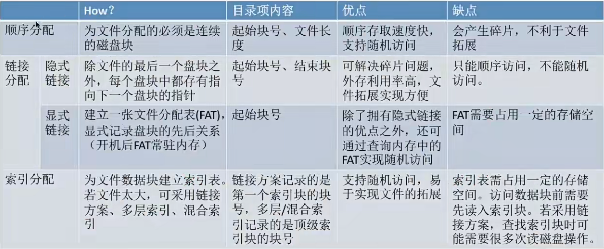

## 文件的物理结构 - 文件的分配方式
操作系统需要管理的磁盘块：空闲磁盘块、非空闲磁盘块(非空闲磁盘也就是保存了文件数据的磁盘块)

这个标题探讨的其实就是文件数据应该怎样存放在外存中

类似于内存分页，磁盘中的存储单元也会被分为一个个“块/磁盘块/物理块”。很多操作系统中，磁盘块的大小与内存块、页面的大小相同。

在内存管理中，进程的逻辑地址空间被划分为了一个个页面

同样的，在外存管理中，为了方便对文件数据的管理，文件的逻辑地址空间也被分为了一个一个的文件“块”6于是文件的逻辑地址也可以表示为(逻辑块号，块内地址) 的形式

#### 连续分配
要求每个文件在磁盘上占用一组连续的块

所以文件目录中需要记录文件的起始块号和长度，总共占用几个块

物理块号 = 起始块号+逻辑块号 (要检查逻辑块号是否合法，如果逻辑块号>长度就不合法)

读取某个磁盘块时，需要移动磁头。访问的两个磁盘块相隔越远，移动磁头所需时间就越长。

优点：支持顺序访问和直接发访问和随机访问，连续分配的文件在顺序读/写的时候速度最快

缺点: 
1. 物理上采用连续分配的文件不方便拓展
2. 物理上采用连续分配,存储空间利用率低，会产生难以利用的磁盘碎片。可以用紧凑来处理碎片，但是需要耗费很大的时间代价。

#### 链接分配 (默认隐式分配)
链接分配采取离散分配的方式，可以为文件分配离散的磁盘块。分为隐式链接和显式链接两种。
1. 隐式链接
也就是目录中记录文件存放的起始块号和结束块号，也可以增加一个字段表示文件长度

除了文件最后一个磁盘块，每个磁盘块中都会保存下一个盘块的指针，这些指针对用户是透明的。

结论1:采用链式分配(隐式链接)方式的文件，只支持顺序访问，不支持随机访问，查找效率低。另外，指向下一个盘块的指针也需要耗费少量的存储空间

结论2:采用隐式链接的链接分配方式，很方便文件拓展另外，所有的空闲磁盘块都可以被利用，不会有碎片问题外存利用率高。

=== 总结 ===

隐式链接--除文件的最后一个盘块之外，每个盘块中都存有指向下一个盘块的指针。文件目录包括文件第一块的指针和最后一块的指针

优点:很方便文件拓展，不会有碎片问题，外存利用率高。

缺点:只支持顺序访问，不支持随机访问，查找效率低，指向下一个盘块的指针也需要耗费少量的存储空间。

2. 显式链接
把用于链接文件各物理块的指针显式地存放在一张表中。即 文件分配表 (FAT，File Allocation Table )

目录中只需要记录起始块号

注意:一个磁盘仅设置一张FAT.开机时，将FAT读入内存，并常驻内存。FAT 的各个表项在物理上连续存储，且每一个表项长度相同，因此“物理块号”字段可以是隐含的。

从目录项中找到起始块号，若i>0，则查询内存中的文件分配表FAT往后找到i 号逻辑块对应的物理块号。逻辑块号转换成物理块号的过程不需要读磁盘操作。

结论:采用链式分配(显式链接) 方式的文件，支持顺序访问，也支持随机访问 (想访问i号逻辑块时，并不需要依次访问之前的 0~i-1号逻辑块)，由于块号转换的过程不需要访问磁盘，因此相比于隐式链接来说，访问速度快很多。

显然，显式链接也不会产生外部碎片，也可以很方便地对文件进行拓展

=== 总结 ===
显式链接--把用于链接文件各物理块的指针显式地存放在一张表中，即 文件分配表(FAT，FileAllocation Table)。一个磁盘只会建立一张文件分配表。开机时文件分配表放入内存，并常驻内存。

优点:很方便文件拓展，不会有碎片问题，外存利用率高，并且支持随机访问。相比于隐式链接来说，地址转换时不需要访问磁盘，因此文件的访问效率更高。

缺点:文件分配表的需要占用一定的存储空间。

#### 索引分配
索引分配允许文件离散地分配在各个磁盘块中，系统会为每个文件建立一张索引表，索引表中记录了文件的各个逻辑块对应的物理块(索引表的功能类似于内存管理中的页表一一建立逻辑页面到物理页之间的映射关系)。索引表存放的磁盘块称为索引块。文件数据存放的磁盘块称为数据块。

目录中需要记录文件的索引块是几号磁盘块

可见，索引分配方式可以支持随机访问。文件拓展也很容易实现(只需要给文件分配一个空闲块，并增加一个索引表项即可)。就是要索引表要占用一定的空间

若每个磁盘块1KB，一个索引表4B，则一个磁盘块只能放256个索引项。如果一个文件的大小超过了256块，那么一个磁盘块是装不下文件的整张索引表的，如何解决？

1. 链接方案
如果索引表太大，一个索引块装不下，那么可以将多个索引块链接起来存放。

2. 多层索引
多层索引: 建立多层索引(原理类似于多级页表)。使第一层索引块指向第二层的索引块。还可根据文件大小的要求再建立第三层、第四层索引块。

3. 混合索引
混合索引:多种索引分配方式的结合。例如，一个文件的顶级索引表中，既包含直接地址索引(直接指向数据块)，又包含一级间接索引(指向单层索引表)、还包含两级间接索引(指向两层索引表)。

=== 总结 ===

索引分配允许文件离散地分配在各个磁盘块中，系统会为每个文件建立一张索引表，索引表中记录了文件的各个逻辑块对应的物理块 (索引表的功能类似于内存管理中的页表--建立逻辑页面到物理页之间的映射关系) 。索引表存放的磁盘块称为索引块。文件数据存放的磁盘块称为数据块。若文件太大，索引表项太多，可以采取以下三种方法解决:

1. 链接方案:如果索引表太大，一个索引块装不下，那么可以将多个索引块链接起来存放。缺点:若文件很大，索引表很长，就需要将很多个索引块链接起来。想要找到i号索引块，必须先依次读入O~i-1号索引块，这就导致磁盘I/O次数过多，查找效率低下。

2. 多层索引: 建立多层索引(原理类似于多级页表)。使第一层索引块指向第二层的索引块。还可根据文件大小的要求再建立第三层、第四层索引块。采用《层索引结构，且顶级索引表未调入内存，则访问个数据块只需要K+1次读磁盘操作。缺点: 即使是小文件，访问一个数据块依然需要K+1次读磁盘。

3. 混合索引:多种索引分配方式的结合。例如，一个文件的顶级索引表中，既包含直接地址索引 (直接指向数据块)，又包含一级间接索引(指向单层索引表)、还包含两级间接索引 (指向两层索引表)。优点:对于小文件来说，访问一个数据块所需的读磁盘次数更少。

超级超级超级重要考点:
1. 要会根据多层索引、混合索引的结构计算出文件的最大长度(Key: 各级索引表最大不能超过一个块):
2. 要能自己分析访问某个数据块所需要的读磁盘次数(Key: FCB中会存有指向顶级索引块的指针，因此可以根据FCB读入顶级索引块。每次读入下一级的索引块都需要一次读磁盘操作。另外，要注意题目条件一一顶级索引块是否已调入内存)

### 物理结构vs逻辑结构

