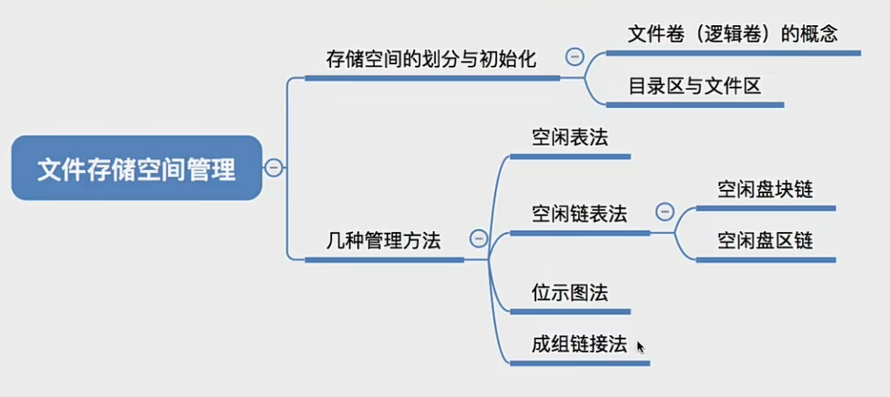

存储空间划分: 将物理磁盘划分为一个个文件卷。 逻辑卷、逻辑盘

存储空间的初始化：将各个文件卷划分为目录区、文件区

# 空闲表法

空闲表：
| 第一个空闲盘块号 | 空闲盘块数 |
|:---:|:---:|
| 0 | 2 |
| 5 | 1 |
| 10 | 5 |
| 18 | 3 |
| 23 | 1 |

适用于连续分配方式

如何分配磁盘块:与内存管理中的动态分区分配很类似，为一个文件分配连续的存储空间。同样可采用首次适应、最佳适应、最坏适应等算法来决定要为文件分配哪个区间。

如何回收磁盘块:与内存管理中的动态分区分配很类似，当回收某个存储区时需要有四种情况--
1. 回收区的前后都没有相邻空闲区;
2. 回收区的前后都是空闲区:
3. 回收区前面是空闲区;
4. 回收区后面是空闲区。

总之，回收时需要注意表项的合并问题

# 空闲链表法
1. 空闲盘块链 - 以盘块为单位组成一条空闲链

2. 空闲盘区链 - 以盘区为单位组成一条空闲链

