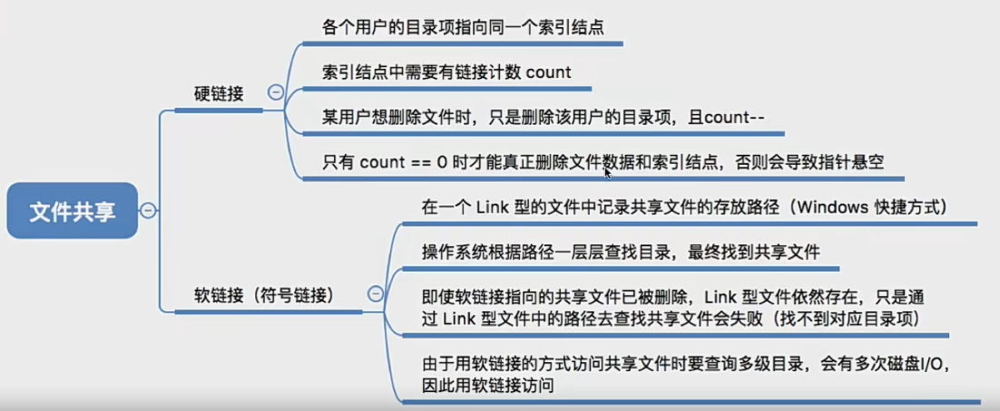
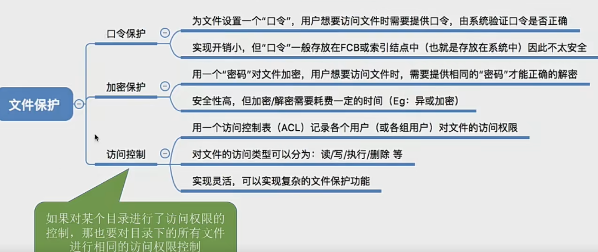
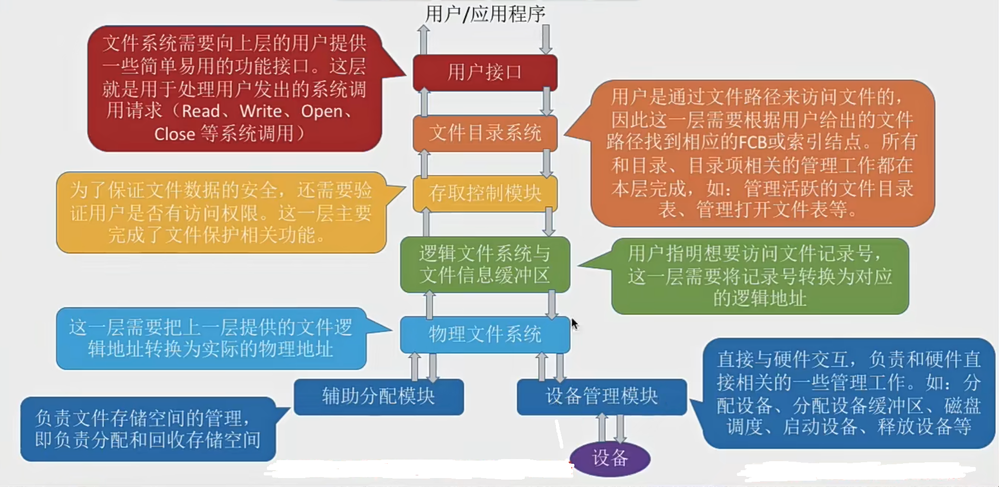
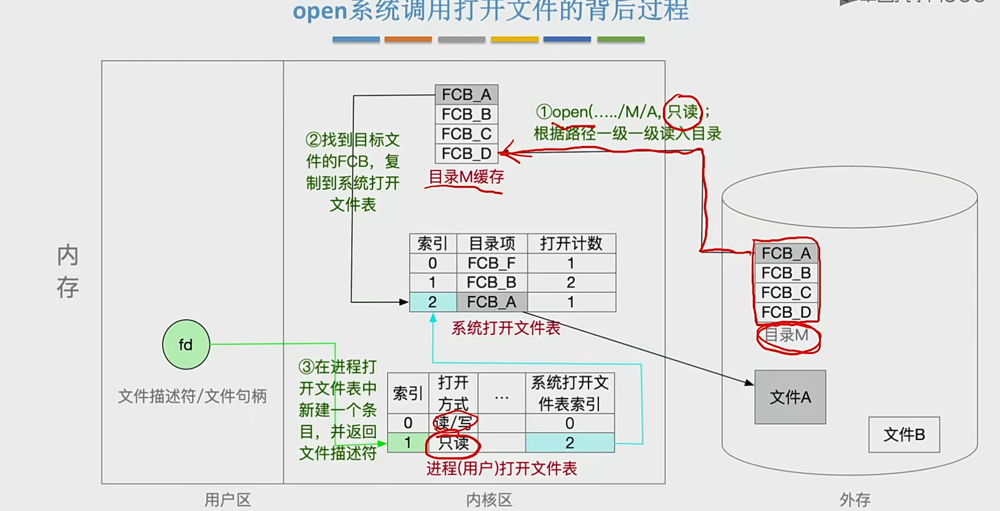
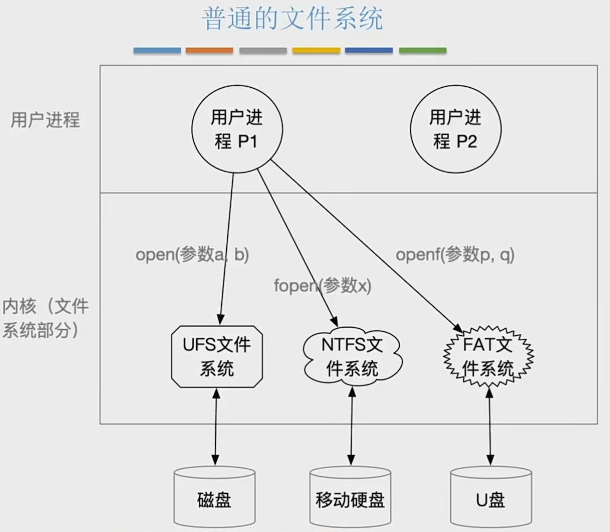
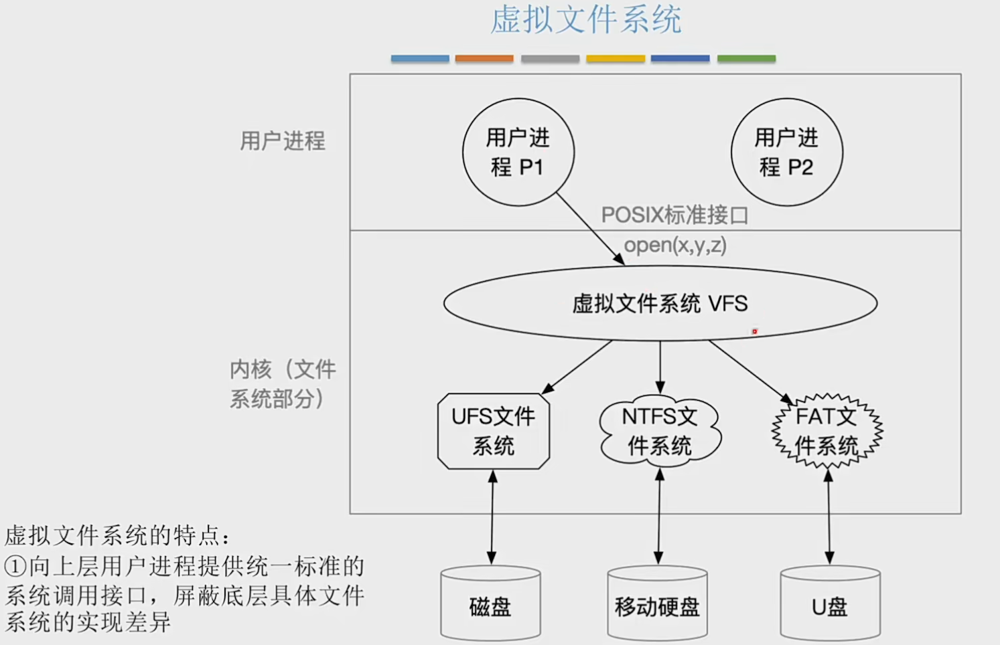
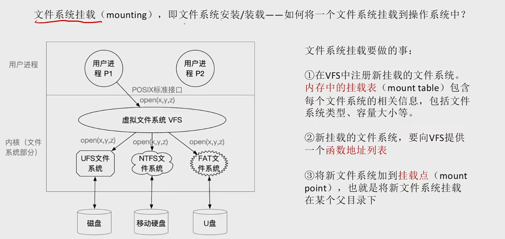

# 文件的基本操作
1. 创建文件 (create系统调用)
需要提供几个主要参数：
- 所需要的外存大小
- 文件存放路径
- 文件名

调用create的时候，操作系统做的事情
- 在外存中找到文件所需的空间 (结合上小节学习的空闲链表法、位示图、成组链接法等管理策略，找到空闲空间)
- 根据文件存放路径的信息找到该目录对应的目录文件 (此处就是 D:/Demo目录)，在目录中创建该文件对应的目录项。目录项中包含了文件名、文件在外存中的存放位置等信息。

2. 删除文件 (delete系统调用)
需要的参数:
- 文件存放路径
- 文件名

操作系统在处理 Delete 系统调用时，主要做了几件事
- 根据文件存放路径找到相应的目录文件，从目录中找到文件名对应的目录项。根据该目录项记录的文件在外存的存放位置
- 文件大小等信息，回收文件占用的磁盘块。(回收磁盘块时，根据空闲表法、空闲链表法位图法等管理策略的不同，需要做不同的处理)
- 从目录表中删除文件对应的目录项

3. 读文件(read系统调用)
可以“读文件”，将文件数据读入内存，才能让CPU处理 (双击后，“记事本”应用程序通过操作系统提供的“读文件”功能，即 read 系统调用，将文件数据从外存读入内存，并显示在屏幕上)

进程使用 read系统调用完成写操作。需要指明是哪个文件(在支持“打开文件”操作的系统中，只需要提供文件在打开文件表中的索引号即可)，还需要指明要读入多少数据 (如: 读入 1KB)、指明读入的数据要放在内存中的什么位置。

操作系统在处理 read 系统调用时，会从读指针指向的外存中，将用户指定大小的数据读入用户指定的内存区域中

4. 写文件(write系统调用)
可以“写文件”，将更改过的文件数据写回外存(我们在“记事本”应用程序中编辑文件内容，点击“保存”后，“记事本”应用程序通过操作系统提供的“写文件”功能，即 write 系统调用，将文件数据从内存写回外存)

进程使用write系统调用完成写操作，需要指明是哪个文件(在支持“打开文件”操作的系统中，只需要提供文件在打开文件表中的索引号即可)，还需要指明要写出多少数据(如:写出1KB)、写回外存的数据放在内存中的什么位置

操作系统在处理 write 系统调用时，会从用户指定的内存区域中，将指定大小的数据写回写指针指向的外存。

5. 打开文件 (open系统调用) * 代开文件并不会把文件数据直接读入内存，只是把文件的目录项信息复制到内存中的打开文件表中，并将打开的文件表的索引号返回给用户
需要参数：
- 文件存放路径
- 文件名
- 要对文件执行的操作类型

操作系统在处理 open 系统调用时，主要做了几件事:
- 根据文件存放路径找到相应的目录文件，从目录中找到文件名对应的的目录项，并检查该用户是否有指定的操作权限。
- 将目录项复制到内存中的“打开文件表”中。并将对应表目的编号返回给用户。之后用户使用打开文件表的编号来指明要操作的文件

有两种打开文件表：
一个是系统的打开文件表

一个是用户进程的打开文件表

6. 关闭文件 (close系统调用)
进程使用完文件后，要“关闭文件”
操作系统在处理 close 系统调用时，主要做了几件事:
- 将进程的打开文件表相应表项删除
- 回收分配给该文件的内存空间等资源
- 系统打开文件表的打开计数器count 减1，若 count =0，则删除对应表项。

# 文件共享
**注意**:多个用户共享同一个文件，意味着系统中只有“一份”文件数据。并且只要某个用户修改了该文件的数据，其他用户也可以看到文件数据的变化。如果是多个用户都“复制”了同一个文件，那么系统中会有“好几份”文件数据。其中一个用户修改了自己的那份文件数据，对其他用户的文件数据并没有影响。

- 基于索引结点的共享方式 硬链接
知识回顾:索引结点，是一种文件目录瘦身策略。由于检索文件时只需用到文件名，因此可以将除了文件名之外的其他信息放到索引结点中。这样目录项就只需要包含文件名、索引结点指针。

索引节点里面还设置了一个链接计数的变量count，用于表示链接到本索引节点上的用户目录项数

- 基于符号链的共享方式 软链接
其实就是link Linux里的link windows的快捷方式

# 文件保护
- 口令保护
为文件设置了一个口令，用户访问文件的时候必须提供口令。

口令一般存放在文件对应的 FCB 或索引结点中。用户访问文件前需要先输入“口令”，操作系统会将用户提供的口令与FCB中存储的口令进行对比，如果正确，则允许该用户访问文件

优点:保存口令的空间开销不多，验证口令的时间开销也很小

缺点:正确的“口令”存放在系统内部，不够安全。

- 加密保护
使用密码进行加密

最简单的加密算法 - 异或加密

系统中保存的不是原始数据，而是加密后的数据

优点:保密性强，不需要在系统中存储“密码”

缺点:编码/译码，或者说加密/解密要花费一定时间

- 访问控制
在每个文件的FCB (或索引结点)中增加一个访问控制列表 (Access-ControlList,ACL)，该表中记录了各个用户可以对该文件执行哪些操作。

访问类型:
1. 读:从文件中读数据
2. 写:向文件中写数据
3. 执行:将文件装入内存并执行
4. 添加:将新信息添加到文件结尾部分
5. 删除:删除文件，释放空间
6. 列表清单:列出文件名和文件属性

精简的访问列表:以“组”为单位，标记各“组”用户可以对文件执行哪些操作如:分为 系统管理员、文件主、文件主的伙伴、其他用户 几个分组。当某用户想要访问文件时，系统会检查该用户所属的分组是否有相应的访问权限

其实就是linux的用户和组

# 文件系统的层次结构

用一个例子来辅助记忆文件系统的层次结构:假设某用户请求删除文件“D:/工作目录/学生信息xlsx”的最后100条记录。

1. 用户需要通过操作系统提供的接口发出上述请求一一&&用户接口**
2. 由于用户提供的是文件的存放路径，因此需要操作系统一层一层地查找目录，找到对应的目录项--**文件目录系统**
3. 不同的用户对文件有不同的操作权限，因此为了保证安全，需要检查用户是否有访问权限--**存取控制模块 (存取控制验证层)**
4. 验证了用户的访问权限之后，需要把用户提供的“记录号”转变为对应的逻辑地址--**逻辑文件系统与文件信息缓冲区**
5. 知道了目标记录对应的逻辑地址后，还需要转换成实际的物理地址--**物理文件系统**
6. 要删除这条记录，必定要对磁盘设备发出请求--**设备管理程序模块**
7. 删除这些记录后，会有一些盘块空闲，因此要将这些空闲盘块回收--**辅助分配模块**

# 文件系统的全局结构 布局

首先磁盘要经历物理格式化 -- 也就是低级格式化，先将磁盘划分扇区，检测坏扇区，并用备用扇区替换坏扇区

然后经历逻辑格式化，将磁盘分区（分卷），完成各分区的文件系统初始化

文件系统在内存中的结构：
近期访问过的目录文件会缓存在内存中，不用每次都从磁盘读入，这样可以加快目录检索速度

# 虚拟文件系统

- 普通文件系统

- 虚拟文件系统

特点：
1. 向上层用户提供了统一标准的系统接口，屏蔽底层具体文件系统的实现差异。
2. 虚拟文件系统 VFS 要求下层的文件系统必须实现某些规定的函数功能，比如 open read write。一个新的文件系统如果想在某个操作系统上被使用，就必须满足VFS的要求
3. 每打开一个文件，VFS就在主存中新建一个 vnode，用统一的数据结构表示文件，无论该文件存储在哪个文件系统。
__存在的问题__:不同的文件系统，表示文件数据结构各不相同打开文件后，其在内存中的表示就不同

所以在虚拟文件系统中打开一个文件后，就会生成一个Vnode v结点，里面包含：
1. 文件名
2. 文件大小
3. 创建者
4. 文件格式
5. ...
6. 函数功能指针

不管来着什么文件系统，都统一用这个数据格式表示文件 并进行调用

注意 Vnode 只存在于主存中。

## 文件系统的挂载

文件系统挂载要做的事:
1. 在VFS中注册新挂载的文件系统内存中的挂载表 (mount table) 包含每个文件系统的相关信息，包括文件系统类型、容量大小等。
2. 新挂载的文件系统，要向VFS提供一个函数地址列表
3. 将新文件系统加到挂载点 (mountpoint)，也就是将新文件系统挂载在某个父目录下
