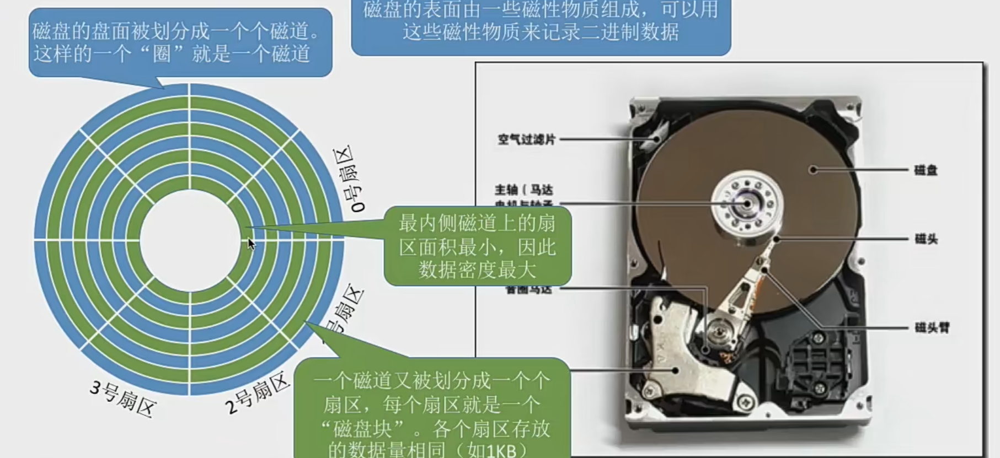
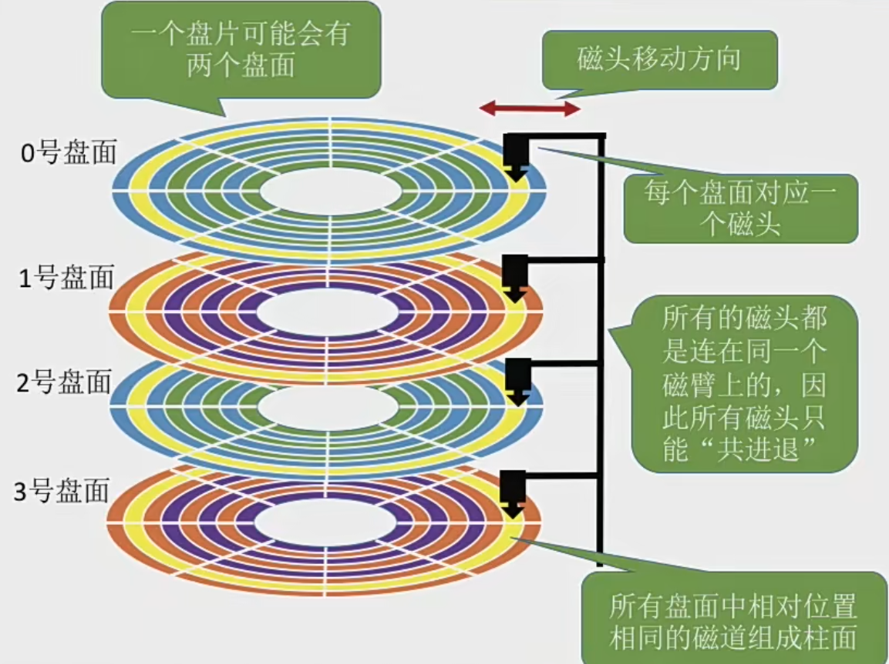
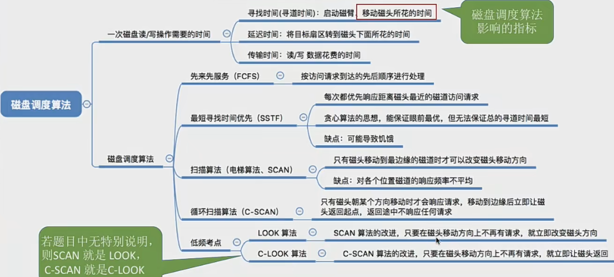
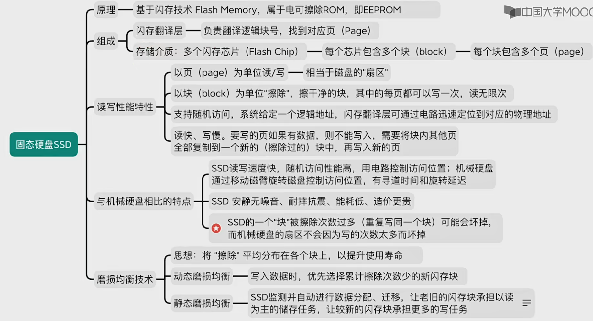
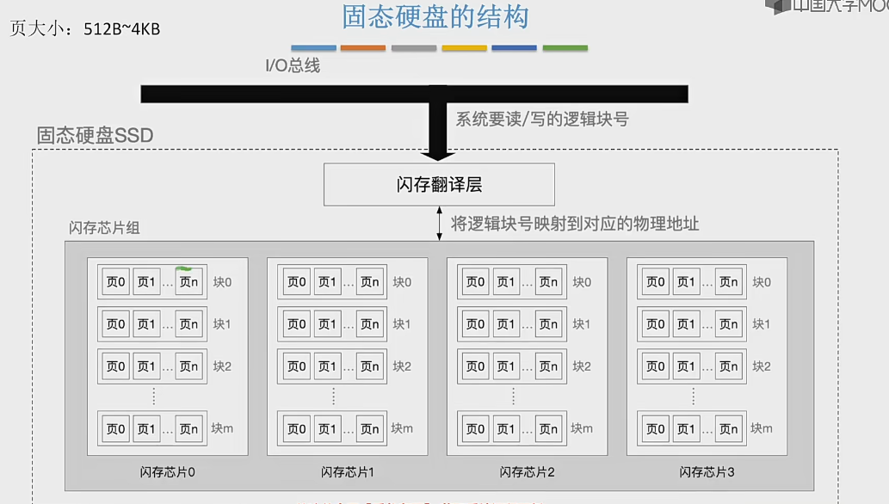

# 磁盘
## 磁盘的结构
磁盘的表面由一些磁性物质组成，可以用这些磁性物质来记录二进制数据

#### 磁盘、磁道、扇区

#### 如何在磁盘中读写数据
需要把 "磁头" 移动到想要读写的扇区所在的磁道，磁盘会转起来，让目标扇区从磁头下面划过，才能完成对扇区的读写操作

#### 盘面、柱面

可用(柱面号，盘面号，扇区号) 来定位任意一个“磁盘块”。在“文件的物理结构”小节中，我们经常提到文件数据存放在外存中的几号块，这个块号就可以转换成(柱面号，盘面号，扇区号)的地址形式。

可根据该地址读取一个"块"
1. 根据"柱面号"移动磁臂,让磁头指向指定柱面；
2. 激活指定盘面对应的磁头
3. 磁盘旋转的过程中，指定的扇区会从磁头下面划过，这样就完成了对指定扇区的读/写。
#### 磁盘的物理地址

#### 磁盘的分类
磁头可以活动的称为活动头磁盘，磁臂可以来回伸缩来带动磁头定位磁道

磁头不可移动的称为固定头磁盘，这种磁盘中每个磁道都有一个磁头

根据盘片是否可更换又可以称为：可换盘磁盘和固定盘磁盘

## 磁盘的调度算法 ~！！！ 高频考点

#### 一次磁盘读写操作需要的时间
1. 寻找时间
寻找时间（寻道时间）Ts: 在读写数据之前，将磁头移动到指定磁道所需要花费的时间
- 启动磁头臂是需要时间的，假设耗时为 a；
- 移动磁头也是需要时间的，假设磁头匀速移动，每跨过一个磁道耗时为m，总共需要跨越n条磁道。则：n*m 为消耗时间

Ts = a + m*n

2. 延迟时间
延迟时间Tr:通过旋转磁盘，使磁头定位到目标扇区所需要的时间。设磁盘转速为r (单位:转/秒，或转/分)，则平均所需的延迟时间

Tr=(1/2)*(1/r)=1/2r

3. 传输时间
传输时间Tt:从磁盘读出或向磁盘写入数据所经历的时间，假设磁盘转速为r，此次读/写的字节数为b，每个磁道上的字节数为 N。则:

传输时间Tt:= (1/r) * (b/N) = b/(r*N)
#### 磁盘调度算法
1. 先来先服务 FCFS
根据进程请求访问磁盘的先后顺序进行调度

优点：公平；如果请求访问的磁道集中的话，性能还过得去。
缺点: 如果有大量进程竞争使用磁盘，请求访问磁道很分散，性能就很差，寻道时间长

2. 最短寻找时间优先 SSTF
SSTF 算法会优先处理的磁道是与当前磁头最近的磁道。可以保证每次的寻道时间最短，但是并不能保证总的寻道时间最短。 (其实就是贪心算法的思想，只是选择眼前最优，但是总体未必最优)

优点:性能较好，平均寻道时间短

缺点:可能产生“饥饿”现象

3. 扫描算法 SCAN
SSTF 算法会产生饥饿的原因在于:磁头有可能在一个小区域内来回来去地移动。为了防止这个问题可以规定，只有磁头移动到最外侧磁道的时候才能往内移动，移动到最内侧磁道的时候才能往外移动。这就是扫描算法 (SCAN)的思想。由于磁头移动的方式很像电梯，因此也叫电梯算法。

优点:性能较好，平均寻道时间较短，不会产生饥饿现象

缺点:
- 只有到达最边上的磁道时才能改变磁头移动方向，事实上，处理了184号磁道的访问请求之后就不需要再往右移动磁头了。
- SCAN算法对于各个位置磁道的响应频率不平均(如:假设此时磁头正在往右移动，且刚处理过90号磁道，那么下次处理90号磁道的请求就需要等磁头移动很长一段距离;而响应了184号磁道的请求之后，很快又可以再次响应 184 号磁道的请求了)

3. 5 LOOK调度算法
扫描算法 (SCAN)中，只有到达最边上的磁道时才能改变磁头移动方向，事实上，处理了184号磁道的访问请求之后就不需要再往右移动磁头了。LOOK 调度算法就是为了解决这个问题，如果在磁头移动方向上已经没有别的请求，就可以立即改变磁头移动方向。 (边移动边观察，因此叫 LOOK)

优点: 比起 SCAN 算法来，不需要每次都移动到最外侧或最内侧才改变磁头方向，使寻道时间进一步缩短

4. 循环扫描算法 C-SCAN
SCAN算法对于各个位置磁道的响应频率不平均，而 C-SCAN 算法就是为了解决这个问题。规定只有磁头朝某个特定方向移动时才处理磁道访问请求，而返回时直接快速移动至起始端而不处理任何请求。

优点:比起SCAN 来，对于各个位置磁道的响应频率很平均。

缺点:只有到达最边上的磁道时才能改变磁头移动方向，事实上，处理了184号磁道的访问请求之后就不需要再往右移动磁头了:并且，磁头返回时其实只需要返回到18号磁道即可，不需要返回到最边缘的磁道。另外，比起SCAN算法来，平均寻道时间更长。

## 减少磁盘延时的方法
假设要连续读取连续的 2、3、4扇区磁头读取一块的内容(也就是一个扇区的内容)后，需要一小段时间处理，而盘片又在不停地旋转因此，如果2、3号扇区相邻着排列，则读完2号扇区后无法连续不断地读入3号扇区必须等盘片继续旋转，3号扇区再次划过磁头，才能完成扇区读入

结论:磁头读入一个扇区数据后需要一小段时间处理如果逻辑上相邻的扇区在物理上也相邻，则读入几个连续的逻辑扇区，可能需要很长的“延迟时间”

减少延时的方法:
1. 交替编号: 若采用交替编号的策略，即让逻辑上相邻的扇区在物理上有一定的间隔，可以使读取连续的逻辑扇区所需要的延迟时间更小。

2. 错位命名
方案一:若相邻的盘面相对位置相同处扇区编号相同

方案二：错位命名  其实也就是相邻盘面的相对位置扇区编号错位命名

## 磁盘的管理
1. 磁盘初始化:

Step 1:进行低级格式化(物理格式化)，将磁盘的各个磁道划分为扇区。一个扇区通常可分为头、数据区域(如512B大小)、尾三个部分组成。管理扇区所需要的各种数据结构一般存放在头、尾两个部分，包括扇区校验码(如奇偶校验、CRC循环冗余校验码等，校验码用于校验扇区中的数据是否发生错)

Step 2:将磁盘分区，每个分区由若干柱面组成(即分为我们熟悉的 C盘、D盘、E盘)

Step 3:进行逻辑格式化，创建文件系统。包括创建文件系统的根目录、初始化存储空间管理所用的数据结构(如位示图空闲分区表)

2. 引导块：

计算机开机时需要进行一系列初始化的工作，这些初始化工作是通过执行初始化程序 (自举程序) 完成的，

初始化程序可以放在ROM (只读存储器) 中。ROM中的数据在出厂时就写入了，并且以后不能再修改

ROM一般是出厂的时候就集成在主板上。ROM中只存放很小的"自举装入程序"。完整的自举程序回复昂在磁盘的启动块上，启动块位于磁盘的固定位置

开机时计算机先运行“自举装入程序”，通过执行该程序就可找到引导块，并将完整的“自举程序”读入内存，完成初始化

3. 坏块的管理
对于简单的磁盘，可以在逻辑格式化时(建立文件系统时)对整个磁盘进行坏块检查，标明哪些扇区是坏扇区比如:在 FAT 表上标明。 (在这种方式中，坏块对操作系统不透明)

对于复杂的磁盘，磁盘控制器(磁盘设备内部的一个硬件部件)会维护一个坏块链表。

在磁盘出厂前进行低级格式化(物理格式化)时就将坏块链进行初始化

会保留一些“备用扇区”，用于替换坏块。这种方案称为扇区备用。且这种处理方式中，坏块对操作系统透明

## 固态硬盘

