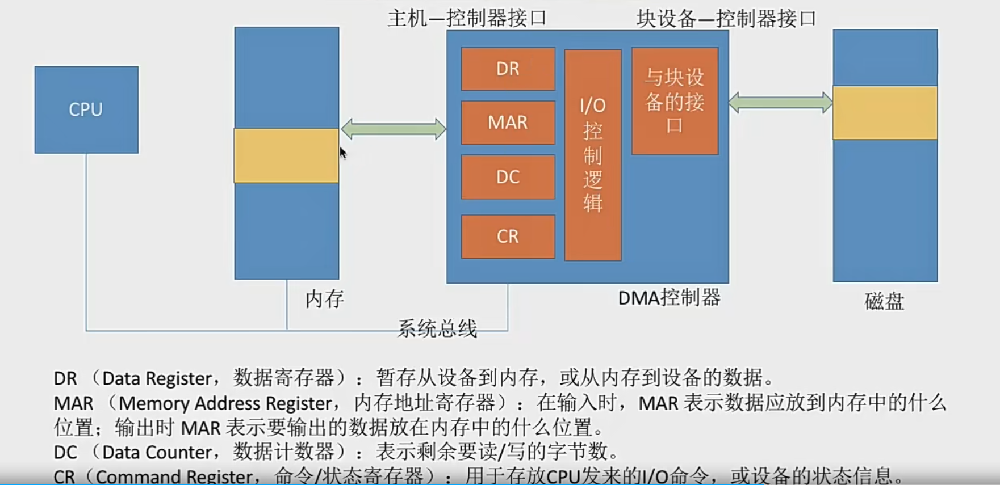

# 设备管理

## IO设备的概念与分类
1. 什么是I/O设备
I/O 就是 输入和输出  Input Output

I/O 设备就是可以将数据输入到计算机，或者可以接收计算机输出数据的外部设备，属于计算机中的
硬件部件。

2. 按使用特性分类
- 人机交互类外部设备
数据传输速度慢
- 存储设备
数据传输速度块
- 网路通信设备
速度介于上面两者之间

3. 按传输速率分类
- 低速设备
- 中速设备
- 高速设备

4. 按信息交换的单位分类
- 块设备 
磁盘、硬盘，传输的基本单位是“块”，传输速率高，可寻址，即对它可以随机的读写任意一块数据

- 字符设备
键盘鼠标，传输的基本单位是字符。传输慢，不可寻址，采用中断驱动方式

=== 

## I/O控制器
I/O 设备由机械部件、电子部件(I/O控制器、设备控制器) 组成

I/O设备的机械部件主要用来执行具体I/O操作。如我们看得见摸得着的鼠标/键盘的按钮:显示器的LED屏:移动硬盘的磁臂、磁盘盘面

I/O设备的电子部件通常是一块插入主板扩充槽的印刷电路板

CPU无法直接控制I/0设备的机械部件，因此1/0设备还要有一个电子部件作为CPU和0设备机械部件之间的“中介”，用于实现CPU对设备的控制。

I/O控制器功能：
1. 接受和识别CPU发出的命令
如CPU发来的 read/write 命令，I/0控制器中会有相应的控制寄存器来存放命令和参数
2. 向CPU报告设备的状态
l/o控制器中会有相应的状态寄存器，用于记录/O设备的当前状态。如:1表示空闲，0表示忙碌
3. 数据交换
l/0控制器中会设置相应的数据寄存器。输出时数据寄存器用于暂存CPU发来的数据，之后再由控制器传送设备。输入时，数据寄存器用于暂存设备发来的数据，之后CPU从数据寄存器中取走数据
4. 地址识别
类似于内存的地址，为了区分设备控制器中的各个寄存器，也需要给各个寄存器设置一个特定的“地址”。l/0控制器通过CPU提供的“地址”来判断CPU要读/写的是哪个寄存器

I/O控制器的组成：
1. CPU与控制器的接口
用于实现CPU与控制器之间的通信。CPU通过控制线发出命令;通过地址线指明要操作的设备;通过数据线来取出(输入) 数据，或放入(输出) 数据
2. I/O逻辑
负责接收和识别CPU的各种命令，比如地址译码，并负责对设备发出命令
3. 控制器与设备的接口
用于实现控制器与设备之间的通信

注意的细节：
1. 一个控制器可能会对应多个设备;
2. 数据寄存器、控制寄存器、状态寄存器可能有多个(如:每个控制/状态寄存器对应一个具体的设备)，且这些寄存器都要有相应的地址，才能方便CPU操作。有的计算机会让这些寄存器占用内存地址的一部分，称为内存映像I/0: 另一些计算机则采用I/0专用地址，即寄存器独立编址

=== 

## I/O控制方式
- 程序直接控制方式
- 中断驱动方式
- DMA方式
- 通道控制方式

需要注意的问题:
1. 完成一次读/写操作的流程;
2. CPU干预的频率:
3. 数据传送的单位:
4. 数据的流向;
5. 主要缺点和主要优点

#### 程序直接控制方式
key word: 轮询
1. 完成一次读写流程

2. CPU干预的频率
很频繁，I/O操作开始之前、完成之后需要CPU介入，并且在等待I/0完成的过程中CPU需要不断地轮询检查。

3. 数据传送的单位
每次读写一个字

4. 数据的流向
读操作(数据输入):I\O设备>CPU>内存
写操作(数据输出):内存>CPU>I/0设备

这里的cpu指的是CPU的寄存器

每个字的读/写都需要CPU的帮助

5. 主要缺点和主要优点
优点:实现简单。在读/写指令之后，加上实现循环检查的系列指令即可(因此才称为“程序直接控制方式”)

缺点: CPU和I/0设备只能串行工作，CPU需要一直轮询检查，长期处于“忙等”状态 ，CPU利用率低

#### 中断驱动方式
引入中断机制。由于I/0设备速度很慢，因此在CPU发出读/写命令后，可将等待I/0的进程阻塞，先切换到别的进程执行。当I/0完成后，控制器会向CPU发出一个中断信号，CPU检测到中断信号后，会保存当前进程的运行环境信息，转去执行中断处理程序处理该中断。处理中断的过程中，CPU从/O控制器读一个字的数据传送到CPU寄存器，再写入主存。接着，CPU恢复等待I/0的进程 (或其他进程) 的运行环境，然后继续执行。

1. 完成一次读写流程

- CPU 会在每个指令周期的末尾检查中断
- 中断处理过程中需要保存、恢复进程的运行环境，这个过程是需要一定时间开销的。可见，如果中断发生的频率太高，也会降低系统性能。

2. CPU干预的频率
每次I/O操作开始之前、完成之后需要CPU介入。
等待I/O完成的过程中CPU可以切换其他进程执行

3. 数据传送的单位
每次读写一个字

4. 数据的流向
读操作(数据输入):I\O设备>CPU>内存
写操作(数据输出):内存>CPU>I/0设备

5. 主要缺点和主要优点
优点:与“程序直接控制方式”相比，在“中断驱动方式”中，I/O控制器会通过中断信号主动报告I/O已完成，CPU不再需要不停地轮询。CPU和I/0设备可并行工作，CPU利用率得到明显提升。

缺点:每个字在I/0设备与内存之间的传输，都需要经过CPU。而频繁的中断处理会消耗较多的CPU时间。

#### DMA方式
与“中断驱动方式”相比，DMA方式 ( Diret Memory Access，直接存储器存取。主要用于块设备的I/O控制)有这样几个改进:

 1. 数据的传送单位是“块”。不再是一个字、一个字的传送;
 2. 数据的流向是从设备直接放入内存，或者从内存直接到设备。不再需要CPU作为“快递小哥
 3. 仅在传送一个或多个数据块的开始和结束时，才需要CPU干预。

 

 CPU指明此次要进行的操作 (如: 读操作)，并说明要读入多少数据、数据要存放在内存的什么位置数据在外部设备上的地址 (如: 在磁盘上的地址)

 控制器会根据CPU提出的要求完成数据的读/写工作整块数据的传输完成后，才向CPU发出中断信号

 组成：
 1. 主机-控制器接口
 2. 块设备-控制器接口
 3. I/O控制器

 
DMA分析：
1. 完成一次读写流程

2. CPU干预的频率
仅在传送一个或多个数据块的开始和结束时，才需要CPU干预。

3. 数据传送的单位
每次读/写一个或多个块 (注意: 每次读写的只能是连续的多个块，且这些块读入内存后在内存中也必须是连续的)

4. 数据的流向
读操作(数据输入):I\O设备>内存
写操作(数据输出):内存>I/0设备

5. 主要缺点和主要优点
优点:数据传输以“块”为单位，CPU介入频率进一步降低。数据的传输不再需要先经过CPU再写入内存，数据传输效率进一步增加。CPU和I/0设备的并行性得到提升。

缺点: CPU每发出一条I/0指令，只能读/写一个或多个连续的数据块。

#### 通道控制方式
通道:一种硬件，可以理解为是“弱鸡版的CPU”。通道可以识别并执行一系列通道指令

与CPU相比，通道可以执行的指令很单一，并且通道程序是放在主机内存中的，也就是说通道与CPU共享内存

1. 完成一次读写流程

2. CPU干预的频率
极低，通道会根据CPU的指示执行相应的通道程序，只有完成一组数据块的读/写后才需要发出中断信号，请求CPU干预。 

3. 数据传送的单位
每次读/写一组数据块 

4. 数据的流向
读操作(数据输入):I\O设备>内存
写操作(数据输出):内存>I/0设备

5. 主要缺点和主要优点
缺点:实现复杂，需要专门的通道硬件支持

优点: CPU、通道、I/设备可并行工作，资源利用率很高

=== 总结

=== 

## I/O软件层次结构

每一层会利用其下层提供的服务，实现某些功能，并屏蔽实现的具体细节，向高层提供服务 (“封装思想”)

1. 用户层软件实现了与用户交互的接口，用户可直接使用该层提供的、与I/O操作相关的库函数对设备进行操作
中间的设备独立性软件也会被叫做系统调用层
2. 用户层软件将用户请求翻译成格式化的/O请求，并通过“系统调用”请求操作系统内核的服务
3. 设备独立性软件，又称设备无关性软件。与设备的硬件特性无关的功能几乎都在这一层实现。
>   1. 向上层提供统一的调用接口 (如 read/write 系统调用)
>   2. 设备的保护
>   原理类似与文件保护。设备被看做是一种特殊的文件，不同用户对各个文件的访问权限是不一样的，同理，对设备的访问权限也不一样。
>   3. 差错处理：设备独立性软件需要对一些设备的错误进行处理
>   4. 设备的分配与回收
>   5. 数据缓冲区管理：可以通过缓冲技术屏蔽设备之间数据交换单位大小和传输速度的差异
>   6. 建立逻辑设备名到物理设备名的映射关系;根据设备类型选择调用相应的驱动程序
>   设备独立性软件需要通过“逻辑设备表 (LUT，Logical UnitTable)”来确定逻辑设备对应的物理设备，并找到该设备对应的设备驱动程序
>
>   操作系统系统可以采用两种方式管理逻辑设备表 (LUT) :
>   - 第一种方式，整个系统只设置一张LUT，这就意味着所有用户不能使用相同的逻辑设备名，因此这种方式只适用于单用户操作系统。
>   - 第二种方式，为每个用户设置一张LUT、各个用户使用的逻辑设备名可以重复，适用于多用户操作系统。系统会在用户登录时为其建立一个用户管理进程，而LUT就存放在用户管理进程的PCB中。

4. 设备驱动程序：主要负责对硬件设备的具体控制，将上层发出的一系列命令(如read/write) 转化成特定设备“能听得懂”的一系列操作。包括设置设备寄存器:检查设备状态等
5. 中断处理程序:  当/0任务完成时，l/o控制器会发送一个中断信号，系统会根据中断信号类型找到相应的中断处理程序并执行。中断处理程序的处理流程如下:

中断处理程序也会和硬件打交道

=== 总结 

理解并记住I/O软件各个层次之间的顺序，要能够推理判断某个处理应该是在哪个层次完成的(最常考的是设备独立性软件、设备驱动程序这两层。只需理解一个特点即可:直接涉及到硬件具体细节、且与中断无关的操作肯定是在设备驱动程序层完成的: 没有涉及硬件的、对各种设备都需要进行的管理工作都是在设备独立性软件层完成的)

## 输入/输出应用程序接口 & 设备驱动程序接口

