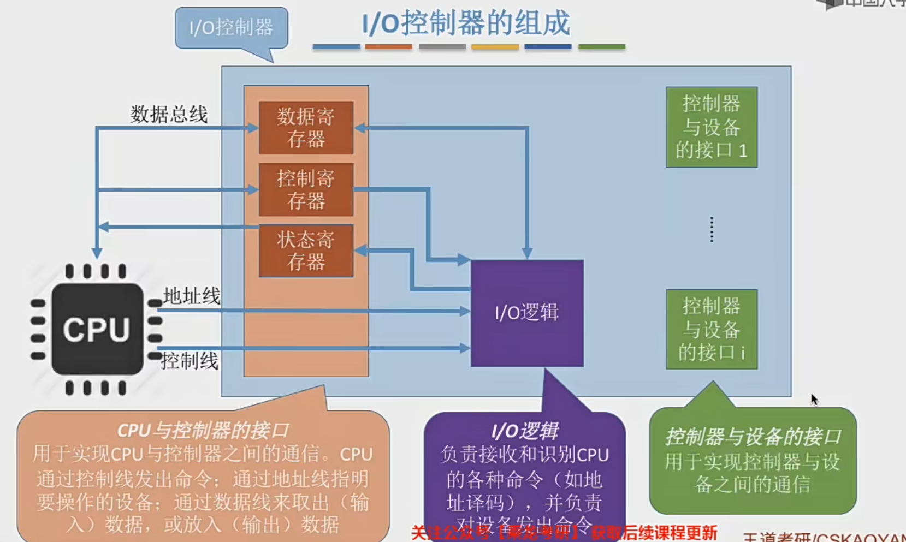

# 设备管理

## IO设备的概念与分类
1. 什么是I/O设备
I/O 就是 输入和输出  Input Output

I/O 设备就是可以将数据输入到计算机，或者可以接收计算机输出数据的外部设备，属于计算机中的
硬件部件。

2. 按使用特性分类
- 人机交互类外部设备
数据传输速度慢
- 存储设备
数据传输速度块
- 网路通信设备
速度介于上面两者之间

3. 按传输速率分类
- 低速设备
- 中速设备
- 高速设备

4. 按信息交换的单位分类
- 块设备 
磁盘、硬盘，传输的基本单位是“块”，传输速率高，可寻址，即对它可以随机的读写任意一块数据

- 字符设备
键盘鼠标，传输的基本单位是字符。传输慢，不可寻址，采用中断驱动方式

=== 

## I/O控制器
I/O 设备由机械部件、电子部件(I/O控制器、设备控制器) 组成

I/O设备的机械部件主要用来执行具体I/O操作。如我们看得见摸得着的鼠标/键盘的按钮:显示器的LED屏:移动硬盘的磁臂、磁盘盘面

I/O设备的电子部件通常是一块插入主板扩充槽的印刷电路板

CPU无法直接控制I/0设备的机械部件，因此1/0设备还要有一个电子部件作为CPU和0设备机械部件之间的“中介”，用于实现CPU对设备的控制。

I/O控制器功能：
1. 接受和识别CPU发出的命令
如CPU发来的 read/write 命令，I/0控制器中会有相应的控制寄存器来存放命令和参数
2. 向CPU报告设备的状态
l/o控制器中会有相应的状态寄存器，用于记录/O设备的当前状态。如:1表示空闲，0表示忙碌
3. 数据交换
l/0控制器中会设置相应的数据寄存器。输出时数据寄存器用于暂存CPU发来的数据，之后再由控制器传送设备。输入时，数据寄存器用于暂存设备发来的数据，之后CPU从数据寄存器中取走数据
4. 地址识别
类似于内存的地址，为了区分设备控制器中的各个寄存器，也需要给各个寄存器设置一个特定的“地址”。l/0控制器通过CPU提供的“地址”来判断CPU要读/写的是哪个寄存器

I/O控制器的组成：
1. CPU与控制器的接口
用于实现CPU与控制器之间的通信。CPU通过控制线发出命令;通过地址线指明要操作的设备;通过数据线来取出(输入) 数据，或放入(输出) 数据
2. I/O逻辑
负责接收和识别CPU的各种命令，比如地址译码，并负责对设备发出命令
3. 控制器与设备的接口
用于实现控制器与设备之间的通信

注意的细节：
1. 一个控制器可能会对应多个设备;
2. 数据寄存器、控制寄存器、状态寄存器可能有多个(如:每个控制/状态寄存器对应一个具体的设备)，且这些寄存器都要有相应的地址，才能方便CPU操作。有的计算机会让这些寄存器占用内存地址的一部分，称为内存映像I/0: 另一些计算机则采用I/0专用地址，即寄存器独立编址

=== 

## I/O控制方式
- 程序直接控制方式
- 中断驱动方式
- DMA方式
- 通道控制方式

需要注意的问题:
1. 完成一次读/写操作的流程;
2. CPU干预的频率:
3. 数据传送的单位:
4. 数据的流向;
5. 主要缺点和主要优点

#### 程序直接控制方式
key word: 轮询
1. 完成一次读写流程

2. CPU干预的频率
很频繁，I/O操作开始之前、完成之后需要CPU介入，并且在等待I/0完成的过程中CPU需要不断地轮询检查。

3. 数据传送的单位
每次读写一个字

4. 数据的流向
读操作(数据输入):I\O设备>CPU>内存
写操作(数据输出):内存>CPU>I/0设备

这里的cpu指的是CPU的寄存器

每个字的读/写都需要CPU的帮助

5. 主要缺点和主要优点
优点:实现简单。在读/写指令之后，加上实现循环检查的系列指令即可(因此才称为“程序直接控制方式”)

缺点: CPU和I/0设备只能串行工作，CPU需要一直轮询检查，长期处于“忙等”状态 ，CPU利用率低

#### 中断驱动方式
引入中断机制。由于I/0设备速度很慢，因此在CPU发出读/写命令后，可将等待I/0的进程阻塞，先切换到别的进程执行。当I/0完成后，控制器会向CPU发出一个中断信号，CPU检测到中断信号后，会保存当前进程的运行环境信息，转去执行中断处理程序处理该中断。处理中断的过程中，CPU从/O控制器读一个字的数据传送到CPU寄存器，再写入主存。接着，CPU恢复等待I/0的进程 (或其他进程) 的运行环境，然后继续执行。

1. 完成一次读写流程

- CPU 会在每个指令周期的末尾检查中断
- 中断处理过程中需要保存、恢复进程的运行环境，这个过程是需要一定时间开销的。可见，如果中断发生的频率太高，也会降低系统性能。

2. CPU干预的频率
每次I/O操作开始之前、完成之后需要CPU介入。
等待I/O完成的过程中CPU可以切换其他进程执行

3. 数据传送的单位
每次读写一个字

4. 数据的流向
读操作(数据输入):I\O设备>CPU>内存
写操作(数据输出):内存>CPU>I/0设备

5. 主要缺点和主要优点
优点:与“程序直接控制方式”相比，在“中断驱动方式”中，I/O控制器会通过中断信号主动报告I/O已完成，CPU不再需要不停地轮询。CPU和I/0设备可并行工作，CPU利用率得到明显提升。

缺点:每个字在I/0设备与内存之间的传输，都需要经过CPU。而频繁的中断处理会消耗较多的CPU时间。

#### DMA方式
与“中断驱动方式”相比，DMA方式 ( Diret Memory Access，直接存储器存取。主要用于块设备的I/O控制)有这样几个改进:

 1. 数据的传送单位是“块”。不再是一个字、一个字的传送;
 2. 数据的流向是从设备直接放入内存，或者从内存直接到设备。不再需要CPU作为“快递小哥
 3. 仅在传送一个或多个数据块的开始和结束时，才需要CPU干预。

 

 CPU指明此次要进行的操作 (如: 读操作)，并说明要读入多少数据、数据要存放在内存的什么位置数据在外部设备上的地址 (如: 在磁盘上的地址)

 控制器会根据CPU提出的要求完成数据的读/写工作整块数据的传输完成后，才向CPU发出中断信号

 组成：
 1. 主机-控制器接口
 2. 块设备-控制器接口
 3. I/O控制器

 
DMA分析：
1. 完成一次读写流程

2. CPU干预的频率
仅在传送一个或多个数据块的开始和结束时，才需要CPU干预。

3. 数据传送的单位
每次读/写一个或多个块 (注意: 每次读写的只能是连续的多个块，且这些块读入内存后在内存中也必须是连续的)

4. 数据的流向
读操作(数据输入):I\O设备>内存
写操作(数据输出):内存>I/0设备

5. 主要缺点和主要优点
优点:数据传输以“块”为单位，CPU介入频率进一步降低。数据的传输不再需要先经过CPU再写入内存，数据传输效率进一步增加。CPU和I/0设备的并行性得到提升。

缺点: CPU每发出一条I/0指令，只能读/写一个或多个连续的数据块。

#### 通道控制方式
通道:一种硬件，可以理解为是“弱鸡版的CPU”。通道可以识别并执行一系列通道指令

与CPU相比，通道可以执行的指令很单一，并且通道程序是放在主机内存中的，也就是说通道与CPU共享内存

1. 完成一次读写流程

2. CPU干预的频率
极低，通道会根据CPU的指示执行相应的通道程序，只有完成一组数据块的读/写后才需要发出中断信号，请求CPU干预。 

3. 数据传送的单位
每次读/写一组数据块 

4. 数据的流向
读操作(数据输入):I\O设备>内存
写操作(数据输出):内存>I/0设备

5. 主要缺点和主要优点
缺点:实现复杂，需要专门的通道硬件支持

优点: CPU、通道、I/设备可并行工作，资源利用率很高

=== 总结

=== 

## I/O软件层次结构

每一层会利用其下层提供的服务，实现某些功能，并屏蔽实现的具体细节，向高层提供服务 (“封装思想”)

1. 用户层软件实现了与用户交互的接口，用户可直接使用该层提供的、与I/O操作相关的库函数对设备进行操作
中间的设备独立性软件也会被叫做系统调用层
2. 用户层软件将用户请求翻译成格式化的/O请求，并通过“系统调用”请求操作系统内核的服务
3. 设备独立性软件，又称设备无关性软件。与设备的硬件特性无关的功能几乎都在这一层实现。
>   1. 向上层提供统一的调用接口 (如 read/write 系统调用)
>   2. 设备的保护
>   原理类似与文件保护。设备被看做是一种特殊的文件，不同用户对各个文件的访问权限是不一样的，同理，对设备的访问权限也不一样。
>   3. 差错处理：设备独立性软件需要对一些设备的错误进行处理
>   4. 设备的分配与回收
>   5. 数据缓冲区管理：可以通过缓冲技术屏蔽设备之间数据交换单位大小和传输速度的差异
>   6. 建立逻辑设备名到物理设备名的映射关系;根据设备类型选择调用相应的驱动程序
>   设备独立性软件需要通过“逻辑设备表 (LUT，Logical UnitTable)”来确定逻辑设备对应的物理设备，并找到该设备对应的设备驱动程序
>
>   操作系统系统可以采用两种方式管理逻辑设备表 (LUT) :
>   - 第一种方式，整个系统只设置一张LUT，这就意味着所有用户不能使用相同的逻辑设备名，因此这种方式只适用于单用户操作系统。
>   - 第二种方式，为每个用户设置一张LUT、各个用户使用的逻辑设备名可以重复，适用于多用户操作系统。系统会在用户登录时为其建立一个用户管理进程，而LUT就存放在用户管理进程的PCB中。

4. 设备驱动程序：主要负责对硬件设备的具体控制，将上层发出的一系列命令(如read/write) 转化成特定设备“能听得懂”的一系列操作。包括设置设备寄存器:检查设备状态等
5. 中断处理程序:  当/0任务完成时，l/o控制器会发送一个中断信号，系统会根据中断信号类型找到相应的中断处理程序并执行。中断处理程序的处理流程如下:

中断处理程序也会和硬件打交道

=== 总结 

理解并记住I/O软件各个层次之间的顺序，要能够推理判断某个处理应该是在哪个层次完成的(最常考的是设备独立性软件、设备驱动程序这两层。只需理解一个特点即可:直接涉及到硬件具体细节、且与中断无关的操作肯定是在设备驱动程序层完成的: 没有涉及硬件的、对各种设备都需要进行的管理工作都是在设备独立性软件层完成的)

## 输入/输出应用程序接口 & 设备驱动程序接口

阻塞I/0: 应用程序发出I/O系统调用进程需转为阻塞态等待。
eg:字符设备接口-一从键盘读一个字符 get

非阻塞I/0: 应用程序发出I/O系统调用，系统调用可迅速返回，进程无需阻塞等待
eg:块设备接口--往磁盘写数据 write

- 设备驱动程序接口

## IO核心子系统
 IO核心子系统其实就是 设备独立软件层(系统调用层) + 设备驱动层 + 中断处理层

 考研中，我们需要重点理解和掌握的功能是: I/O调度、设备保护、假脱机技术(SPooLing技术)、设备分配与回收、缓冲区管理(即缓冲与高速缓存)

- 假脱机技术(SPooLing技术) - 用户层软件

- I/O调度、设备保护、设备分配与回收、缓冲区管理(即缓冲与高速缓存) - 设备独立性软件

I/O调度：用某种算法确定一个好的顺序来处理各个I/O请求

设备保护: 
操作系统需要实现文件保护功能，不同的用户对各个文件有不同的访问权限(如: 只读、读和
写等)。
在UNIX系统中，设备被看做是一种特殊的文件，每个设备也会有对应的FCB。当用户请求访问某个设备时，系统根据FCB中记录的信息来判断该用户是否有相应的访问权限，以此实现“设备保护”的功能。(参考“文件保护”小节)

#### 假脱机技术(SPooLing技术)

要实现SPOOLing 技术，必须要有多道程序技术的支持。系统会建立“输入进程”和“输出进程”

独占式设备--只允许各个进程串行使用的设备。一段时间内只能满足一个进程的请求。

共享设备--允许多个进程“同时”使用的设备(宏观上同时使用，微观上可能是交替使用)。可以同时满足多个进程的使用请求

当多个用户进程提出输出打印的请求时，系统会答应它们的请求，但是并不是真正把打印机分配给他们,而是由假脱机管理进程为每个进程做两件事:
(1)在磁盘输出井中为进程申请一个空闲缓冲区(也就是说，这个缓冲区是在磁盘上的)，并将要打印的数据送入其中;
(2)为用户进程申请一张空白的打印请求表，并将用户的打印请求填入表中(其实就是用来说明用户的打印数据存放位置等信息的)，再将该表挂到假脱机文件队列上。

SPooLing 技术可以把一台物理设备虚拟成逻辑上的多台设备，可将独占式设备改造成共享设备。

## 设备的分配与回收
- 设备分配时应考虑的因素
1. 设备的固有属性
设备的固有属性可分为三种:独占设备、共享设备、虚拟设备

**独占设备**--一个时段只能分配给一个进程(如打印机)

**共享设备**--可同时分配给多个进程使用(如磁盘)，各进程往往是宏观上同时共享使用设备而微观上交替使用。

**虚拟设备**--采用 SPOOLing 技术将独占设备改造成虚拟的共享设备，可同时分配给多个进程使用(如采用SPOOLing 技术实现的共享打印机)

2. 设备分配算法
FCFS... 

3. 设备分配中的安全性
从进程运行的安全性上考虑，设备分配有两种方式:

- 安全分配方式:为进程分配一个设备后就将进程阻塞，本次I/0完成后才将进程唤醒。(eg:考虑进程请求打印机打印输出的例子)

一个时段内每个进程只能使用一个设备
优点:破坏了“请求和保持”条件，不会死锁
缺点: 对于一个进程来说，CPU和I/0设备只能串行工作

- 不安全分配方式:进程发出/0请求后，系统为其分配I/0设备，进程可继续执行，之后还可以发出新的I/0请求。只有某个I/O请求得不到满足时才将进程阻塞。

一个进程可以同时使用多个设备
优点:进程的计算任务和I/0任务可以并行处理，使进程迅速推进
缺点:有可能发生死锁(死锁避免、死锁的检测和解除 )

- 静态分配与动态分配
静态分配：进程运行前就分配全部所需资源，运行结束后归还资源。
动态分配: 进程运行过程中动态申请资源

- 设备分配管理中的数据结构
**设备控制表 (DCT)**:系统为每个设备配置一张DCT，用于记录设备情况

设备控制表 (DCT)
设备类型：如:打印机/扫描仪/键盘
设备标识符：即物理设备名，系统中的每个设备的物理设备名唯一
设备状态: 忙碌/空闲/故障...
指向控制器表的指针: 每个设备由一个控制器控制，该指针可找到相应控制器的信息
重复执行次数或时间: 当重复执行多次I/O操作后仍不成功，才认为此次I/O失败
设备队列的队首指针: 指向正在等待该设备的进程队列(由进程PCB组成队列)

**控制器控制表(COCT)**:每个设备控制器都会对应一张COCT。操作系统根据COCT的信息对控制器进行操作和管理。

控制器控制表 (COCT)
控制器标识符: 各个控制器的唯一ID
控制器状态: 忙碌/空闲/故障..
指向通道表的指针: 每个控制器由一个通道控制，该指针可找到相应通道的信息
控制器队列的队首指针
控制器队列的队尾指针: 指向正在等待该控制器的进程队列(由进程PCB组成队列)

**通道控制表(CHCT)**:每个通道都会对应一张CHCT。操作系统根据CHCT的信息对通道进行操作和管理。

通道控制表 (CHCT)
通道标识符: 各个通道的唯一ID
通道状态: 空闲/故障..
与通道连接的控制器表首址: 可通过该指针找到该通道管理的所有控制器相关信息 (COCT)
通道队列的队首指针
通道队列的队尾指针: 指向正在等待该通道的进程队列(由进程PCB组成队列)

**系统设备表 (SDT)**:记录了系统中全部设备的情况，每个设备对应一个表目。

表目i
设备类型: 如:打印机/扫描仪/键盘
设备标识符: 即物理设备名
DCT (设备控制表)
驱动程序入口

- 设备分配的步骤
1. 根据进程请求的物理设备名查找SDT(注:物理设备名是进程请求分配设备时提供的参数)
2. 根据SDT找到DCT，若设备忙碌则将进程PCB挂到设备等待队列中，不忙碌则将设备分配给进程。
3. 根据DCT找到COCT，若控制器忙碌则将进程PCB挂到控制器等待队列中，不忙碌则将控制器分配
给进程。
4. 根据COCT找到CHCT，若通道忙碌则将进程PCB挂到通道等待队列中，不忙碌则将通道分配给进
样

注 : 只有设备、控制器、通道三者都分配成功时，这次设备分配才算成功，之后便可后动I/O设备进行数据传送

缺点:
1. 用户编程时必须使用“物理设备名”，底层细节对用户不透明，不方便编程
2. 若换了一个物理设备，则程序无法运行
3. 若进程请求的物理设备正在忙碌，则即使系统中还有同类型的设备，进程也必须阻塞等待

- 设备分配步骤的改进方法
改进方法:建立逻辑设备名与物理设备名的映射机制，用户编程时只需提供逻辑设备名
1. 根据进程请求的逻辑设备名查找SDT(注: 用户编程时提供的逻辑设备名其实就是“设备类型”)
2. 查找SDT，找到用户进程指定类型的、并且空闲的设备，将其分配给该进程。操作系统在逻辑设备表 (LUT) 中新增一个表项。
3. 根据DCT找到COCT，若控制器忙碌则将进程PCB挂到控制器等待队列中，不忙碌则将控制器分配
给进程。
4. 根据COCT找到CHCT，若通道忙碌则将进程PCB挂到通道等待队列中，不忙碌则将通道分配给进
样

逻辑设备表 (LUT) 建立了逻辑设备名与物理设备名之间的映射关系。

某用户进程第一次使用设备时使用逻辑设备名向操作系统发出请求，操作系统根据用户进程指定的设备类型(逻辑设备名)查找系统设备表，找到一个空闲设备分配给进程，并在LUT中增加相应表项。

如果之后用户进程再次通过相同的逻辑设备名请求使用设备则操作系统通过LUT表即可知道用户进程实际要使用的是哪个物理设备了，并且也能知道该设备的驱动程序入口地址。

逻辑设备表的设置问题:

整个系统只有一张LUT: 各用户所用的逻辑设备名不允许重复，适用于单用户操作系统

每个用户一张LUT:不同用户的逻辑设备名可重复，适用于多用户操作系统

## 缓冲区管理
缓冲区是一个存储区域，可以由专门的硬件寄存器组成，也可利用内存作为缓冲区。

使用硬件作为缓冲区的成本较高，容量也较小，一般仅用在对速度要求非常高的场合(如存储器管理中所用的联想寄存器，由于对页表的访问频率极高，因此使用速度很快的联想寄存器来存放页表项的副本)

一般情况下，更多的是利用内存作为缓冲区，“设备独立性软件”的缓冲区管理就是要组织管理好这些缓冲区

缓冲区的作用：
1. 缓和CPU与I/O设备之间速度不匹配的矛盾
2. 减少对CPU的中断频率，放宽对CPU中断相应时间的限制
3. 解决数据粒度不匹配的问题：如:输出进程每次可以生成一块数据但I/0设备每次只能输出一个字符
4. 提高CPU与I/O设备之间的并行性

CPU可以把要输出的数据快速地放入缓冲区，之后就可以做别的事

慢速的I/0设备可以慢慢从缓冲区取走数据

数据输入时类似

#### 单缓冲
假设某用户进程请求某种块设备读入若干块的数据。若采用单缓冲的策略，操作系统会在主存中为其分配一个缓冲区 (若题目中没有特别说明，一个缓冲区的大小就是一个块)。

注意:当缓冲区数据非空时，不能往缓冲区冲入数据，只能从缓冲区把数据传出;当缓冲区为空时可以往缓冲区冲入数据，但必须把缓冲区充满以后，才能从缓冲区把数据传出。

#### 双缓冲
假设某用户进程请求某种块设备读入若干块的数据。若采用双缓冲的策略，操作系统会在主存中为其分配两个缓冲区 (若题目中没有特别说明，一个缓冲区的大小就是一个块)
双缓冲题目中，假设初始状态为: 工作区空，其中一个缓冲区满，另一个缓冲区空

#### 单缓冲/双缓冲在通信时的区别
单缓冲区数据只能单向传递

双缓冲区可以在同一时刻实现双向数据传输

#### 循环缓冲区
将多个大小相等的缓冲区链接成一个循环队列

#### 缓冲池
缓冲池由系统中共用的缓冲区组成。这些缓冲区按使用状况可以分为: 空缓冲队列、装满输入数据的缓冲队列(输入队列)、装满输出数据的缓冲队列(输出队列)。

另外，根据一个缓冲区在实际运算中扮演的功能不同，又设置了四种工作缓冲区:用于收容输入数据的工作缓冲区 (hin)、用于提取输入数据的工作缓冲区(sin)、用于收容输出数据的工作缓中区(hout)、用于提取输出数据的工作缓冲区 (sout)